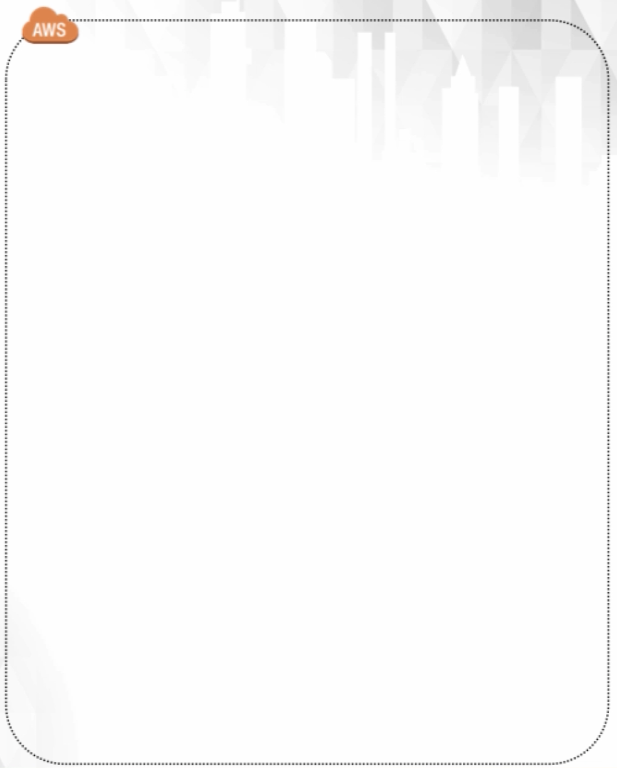
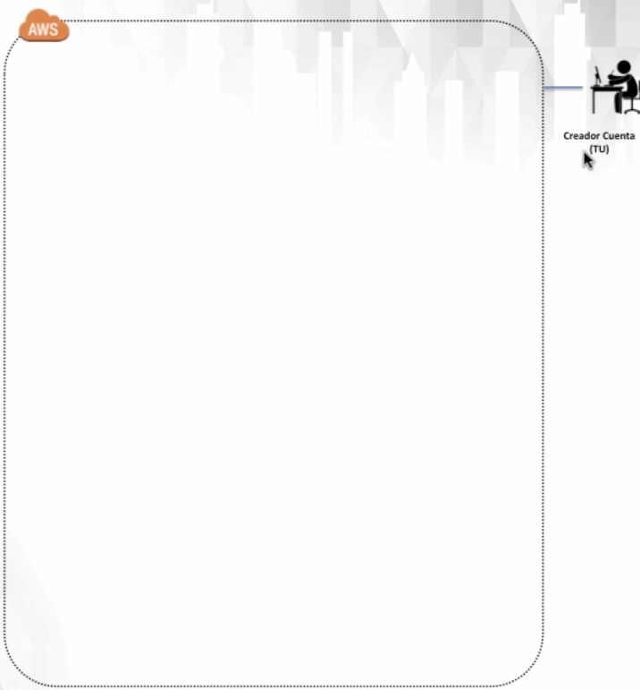
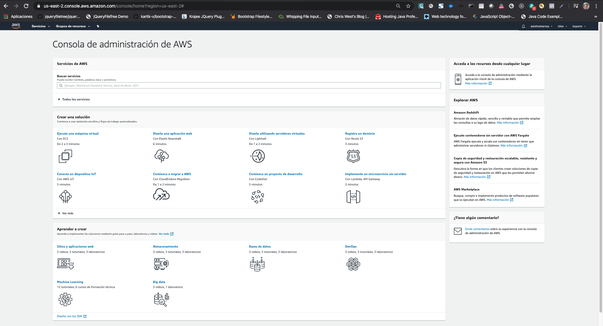
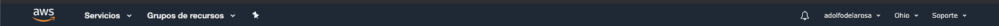
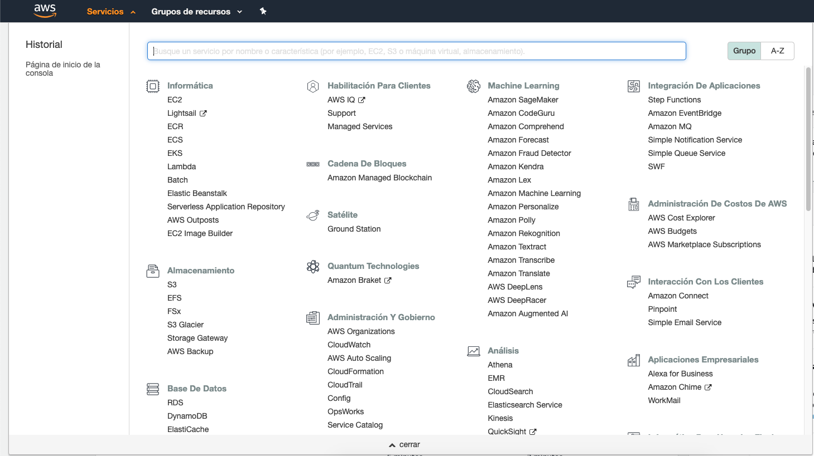
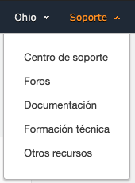
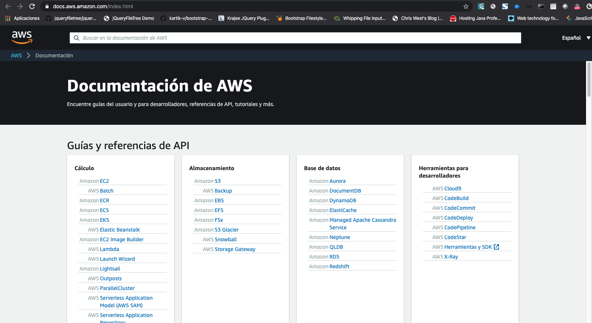
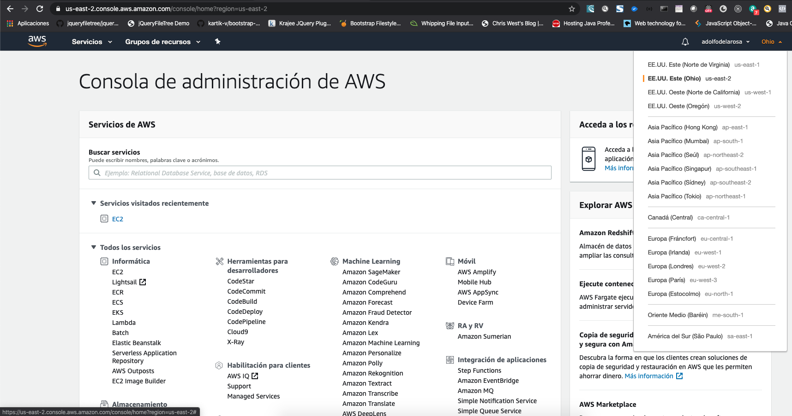
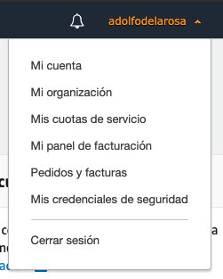

# 2. Conceptos Básicos de una Cuenta Amazon AWS 30:17

* AWS Free Tier (capa gratuita) 10:25
* Crear una cuenta AWS 10:09
* Como navegar por la consola de AWS 09:43

## AWS Free Tier (capa gratuita) 10:25

Empezamos el uso AWS vacio sin nada.

Lo primero que necesitamos es **crear una Cuenta AWS**.

### Lección 1: Conceptos básicos cuenta AWS 

AWS "Free Tier"

* Que es una cuenta AWS "Free Tier"
* Usar cuenta AWS "Free Tier"
* Como crear una cuenta AWS "Free Tier"
* Navegar por la consola AWS

#### Que es una cuenta AWS "Free Tier"

* El nivel libre de AWS hace referencia al uso gratuito *limitado* de los servicios
* AWS ofrece el nivel gratuito como medio para que un usuario aprenda, experimente y obtenga experiencia práctica con los servicios de AWS.
* Casi todos los servicios de AWS ofrecen algún tipo de uso de nivel gratuito.
* El nivel gratuito esta disponible 12 meses después de crear la cuenta AWS
* Algunos servicios amplían el uso de niveles gratis en los últimos 12 meses
* El nivel gratuito solo está disponible para los nuevos clientes de AWS
* Puedes hacer mucho con la cuenta gratuita "Free Tier"

La cuenta gratuita "Free Tier" incluye los siguientes servicios:

* **EC2** (Elastic Compute Cloud)
* **EBS** (Elastic Block Storage)
* **S3** (Simple Storage Services)
* **RDS** (Relational Database Service, ej. MySQL)
* **DynamoDB** (NoSQL Database Service)
* **ELB** (Elastic Load Balancing)
* **SNS** (Simple Notification Service)
* **Lambda** (Serverless Computing)

## Crear una cuenta AWS 10:09

### Lección 2: Crear Cuenta

Crear una cuenta AWS "Free Tier"

* Paso a paso cuenta AWS "Free Tier"
* Como crear una cuenta AWS "Free Tier"

URL: https://aws.amazon.com/es/

1. Haz clic en "iniciar sesión en la consola"
2. Introducir email
3. Asegurate que seleccionas "Soy un nuevo usuario"
4. Completa el formulario de "credenciales de acceso"
5. Selecciona cuenta "Empresa" o "Personal"
6. Completa el resto del formulario de información de contacto
7. Completa el formulario de información de pago "Necesita una tarjeta de crédito valida"
8. Completa el formulario de "verificación de identidad" y seguir las instrucciones para ingresar el número PIN de verificación.
9. Selecciona un plan de soporte (Selecciona "Basic" - sin costo/uso gratuito 
10. Inicia sesión en la consola de AWS con tus credenciales recién creadas

## Como navegar por la consola de AWS 09:43

### Lección 3: Introducción Cuenta AWS

Crear una cuenta AWS "Free Tier"

* Tour por la consola AWS
* Encontrar servicios y funciones

#### Tour por la consola AWS

Aprender a navegar por la consola de AWS para acceder y encontrar los servicios mas interesantes e importantes.

* Servicios AWS
* Soporte/Documentación
* Selección de regiones en AWS
* Configuración de la cuenta

##### Servicios AWS

En la consola tenemos una Barra de Menus.

Si pulsamos en **Servicios** vemos lo siguiente:

Los servicios estan agrupados por categorías. También contamos con un **Buscador servicios** y un **Servicios visitados recientemente**

Basta hacer click en el nombre del Servicio, para que Amazon lo abra.

Siempre se podra regresar a la Home presionando en el logo AWS.

#### Soporte/Documentación

Dentro de la Barra de Menú tenemos la opción **Soporte**:

 

Una de las opciones es Documentación. Si pulsamos en **Documentación** se nos presenta la página de [Documentación de AWS](https://docs.aws.amazon.com/index.html).

#### Selección de Regiones en AWS

En la Barra de Menú tenemos la opción de seleccionar la **Región**.

Por defecto tenemos una región asignada de acuerdo a los datos ingresados en el registro, pero podemos cambiar la región seleccionando una diferente.

#### Configuración de la Cuenta

En la Barra de Menú tenemos la opción de seleccionar la **Cuenta**, al pusar en el nombre de la cuenta vemos las diferentes opciones:

