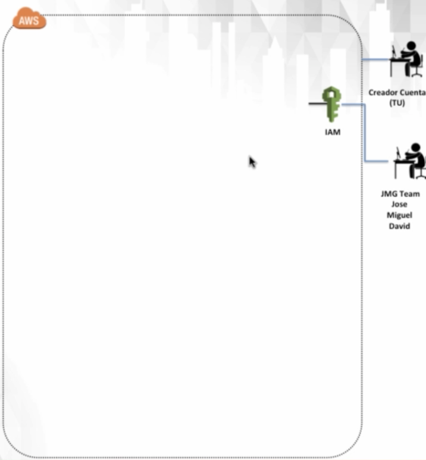
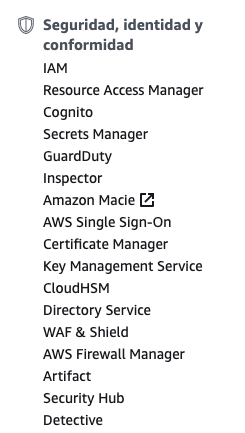
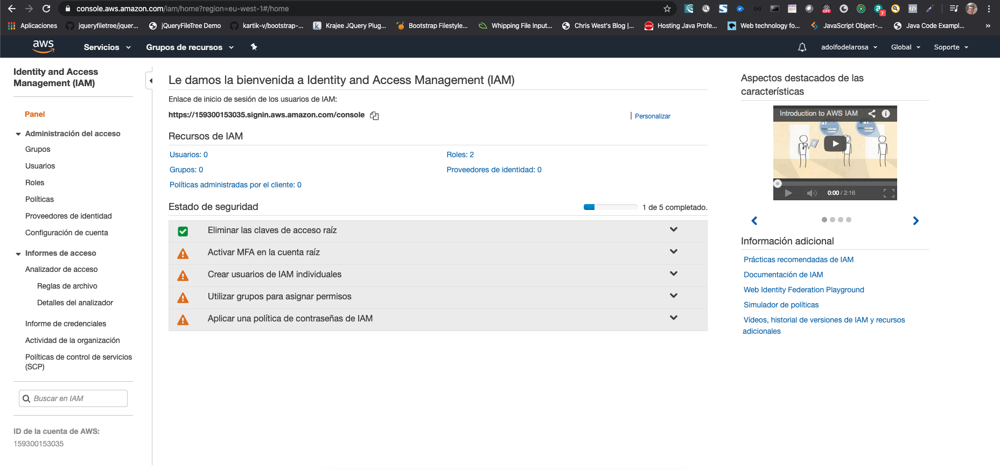

# 3. Identity & Access Management (IAM) 51:02

* ¿Qué es IAM? 06:50
* Configuración inicial de IAM 23:05
* Usuarios y politicas en IAM 07:33
* Grupos y politicas en IAM 07:13
* Roles en IAM 06:21

## ¿Qué es IAM? 06:50

En esta sección veremos la creación de IAM.

### Lección 3: Identity & Accesss Management (IAM)

* Que es IAM
* Configuración y parametrización de IAM
* Explicación de que es y para que se usan los: 
   * Usuarios
   * Grupos
   * Políticas
   * Roles
   
#### Que es IAM

* Que es IAM
* Usos comunes en IAM
* La importancia de la cuenta root

#### Que es IAM

* IAM es donde administras tus usuarios de AWS y su acceso a sus cuentas y servicios de AWS.
* El uso común de IAM es administrar:
   * Usuarios
   * Grupos
   * Políticas de acceso de IAM
   * Roles
* Por defecto el **usuario root** tiene **acceso completo & total** a la cuenta.
* Por defecto cualquier usuario que cree en AWS se crea **sin acceso** a ningún servicio de AWS (excepto para poder iniciar sesión).
* Para todos los usuarios (excepto usuario root) se deben otorgar permisos que permitan el acceso a los servicios de AWS.
* La opción IAM la tenemos en el Grupo **Seguridad, identidad y conformidad** 

   

   Si entramos a la opción tenemos:
   
   
   
   [Video](https://www.youtube.com/watch?time_continue=135&v=Ul6FW4UANGc&feature=emb_logo)

#### Usos comunes en IAM
#### La importancia de la cuenta root

## Configuración inicial de IAM 23:05
## Usuarios y politicas en IAM 07:33
## Grupos y politicas en IAM 07:13
## Roles en IAM 06:21
