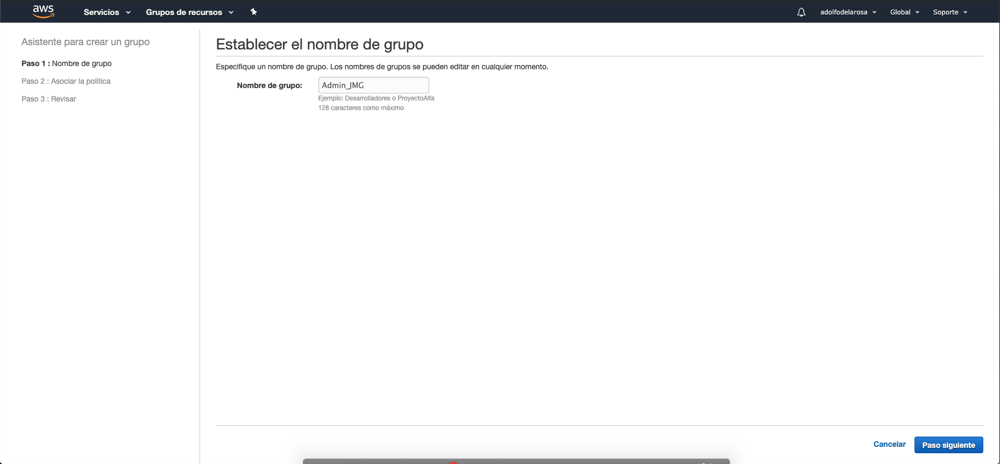
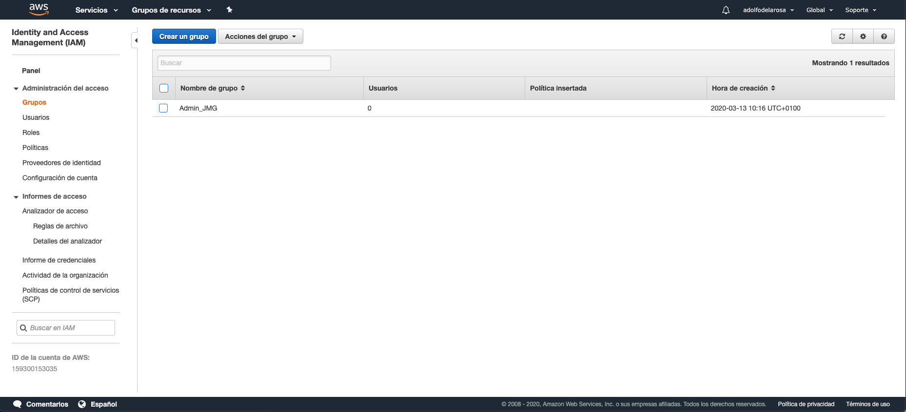
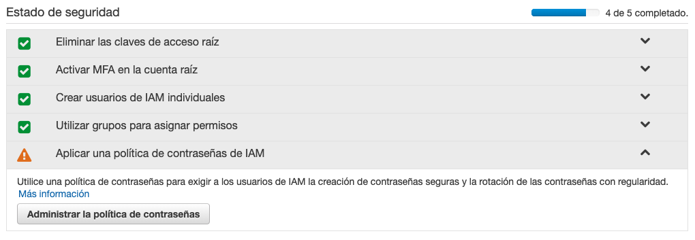

# 3. Identity & Access Management (IAM) 51:02

* ¿Qué es IAM? 06:50
* Configuración inicial de IAM 23:05
* Usuarios y politicas en IAM 07:33
* Grupos y politicas en IAM 07:13
* Roles en IAM 06:21

## ¿Qué es IAM? 06:50

En esta sección veremos la creación de IAM.

Los temas que trataremos son:

* Que es IAM (Identity & Accesss Management )
* Configuración y parametrización de IAM
* Explicación de que es y para que se usan los: 
   * Usuarios
   * Grupos
   * Políticas
   * Roles
   
### Que es IAM

* Que es IAM
* Usos comunes en IAM
* La importancia de la cuenta root

#### Que es IAM

* IAM es donde administras tus usuarios de AWS y su acceso a sus cuentas y servicios de AWS.
* El uso común de IAM es administrar:
   * Usuarios
   * Grupos
   * Políticas de acceso de IAM
   * Roles
* Por defecto el **usuario root** tiene **acceso completo & total** a la cuenta.
* Por defecto cualquier usuario que cree en AWS se crea **sin acceso** a ningún servicio de AWS (excepto para poder iniciar sesión).
* Para todos los usuarios (excepto usuario root) se deben otorgar permisos que permitan el acceso a los servicios de AWS.
* La opción IAM la tenemos en el Grupo **Seguridad, identidad y conformidad** 

   

   Si entramos a la opción IAM tenemos:
   
   
   
   [Video](https://www.youtube.com/watch?time_continue=135&v=Ul6FW4UANGc&feature=emb_logo)

Cuando creamos la cuenta AWS, a su vez se creo el usuario **root** basado en los datos inroducidos como email, nombre, etc. 

#### Usos comunes en IAM

El uso común de IAM es administrar todos los Grupos, Usuarios, Roles, Políticas

#### La importancia de la cuenta root

El usuario **root** tiene acceso a todos los servicios y configuraciones de AWS.

Cuando creamos un nuevo usuario con IAM este se crea sin ningún acceso de los servicios de AWS, lo único que pueden hacer es iniciar sesión. Para que tenga acceso a los servicios de AWS nos apoyaremos con los Grupos, Usuarios, Roles y Políticas de acceso.

## Configuración inicial de IAM 23:05

Los temas que trataremos son:

* Mejores practicas en IAM
* MFA en IAM
* Creación de un usuario y grupo administrador
* Creación de políticas de password en IAM

### Mejores Practicas en IAM

* Pautas que recomiendan configuraciones de arquitectura con el propósito de alcanzar un nivel alto en seguridad, accesibilidad y eficiencia.

* Cuando se crea una nueva cuenta root en AWS, es muy buena práctica completar las tareas enumeradas en la sección de "Estado de seguridad" en IAM. Si entramos a IAM veremos a lo que nos referimos:

Para cumplir con las Mejores practicas de IAM debemos cumplir con las siguientes tareas:

* Estas tareas incluyen lo siguiente:
   * Eliminar las claves de acceso raíz
   * Activar MFA en la cuenta raíz
   * Crear usuarios de IAM individuales
   * Utilizar grupos para asignar permisos
   * Aplicar una política de contraseñas de IAM
   
#### Eliminar las Claves de Acceso Raíz

Esta marcada y de color verde lo que indica que esta tarea ya esta realizada o más bien no existen claves de acceso que borrar para **root** por que no se crearón automáticamente.

#### Activar MFA en la Cuenta Root

* **¿Qué es MFA?**
   * Acrónimo inglés para Multi-Factor Authentification
   * Capa adicional de seguridad para tu cuenta root
   * Código random de seis dígitos continuamente cambiante que necesitas poner (ademas de tu contraseña) para iniciar sesión en tu cuenta root.
   
* **¿Cómo consigo este código MFA?**
   * Dispositivo virtual MFA
      * Teléfono o tableta
      * Aplicación Google Authenticator de uso común (IOS y Android). Instalar Google Authenticator.
   * Dispositivo físico MFA(llavero físico)
      * Dispositivo físico pequeño con pantalla
      * Se compra directamente desde Amazon AWS

Arquitectura de MFA.

Cuando activemos MFA en la cuenta **root**, lo que estamos haciendo es añadiendo un paso intermedio al inicio de sesión del usuario **root**, una vez que ingresemos el email y password se nos solicitará el código MFA, el cual lo encontraremos en el móvil, en la aplicación Google Authenticator, una vez que ingresemos dicho código MFA se nos permitirá entrar a la cuenta de **root**.

Vamos a ver como se activa MFA, pulsamos en **Activar MFA en la cuenta raíz**.

Presionamos el botón **Administrar MFA**, nos lleva a la siguiente pantalla, donde debemos seleccionar la segunda opción **Multi-Factor Authentication (MFA)**.

Aquí pulsaremos el botón **Activar MFA**, nos presenta el siguiente PopUp:
 

Seleccionamos la opción **Dispositivo MFA virtual**, al presionar el botón **Continuar**

Aquí se nos presenta un código Bidi el cual debemos escanear con el móvil con la aplicación Google Authenticator. En la aplicación móvil nos apareceran los códigos de MFA1 y MFA2. Los introducimos y presionamos en **Asignar MFA**.

Finalmente se nos indica que **hemos asignado un tipo de MFA virtual correctamente**.

Al entrar en IAM ya vemos que la opción **Activar MFA en la cuenta raíz** esta activa.

*A partir de aquí, cada que nos conectemos como root se nos pedirán los códigos MFA*

#### Crear Usuarios de IAM Individuales

* Mejor practica en IAM es **NUNCA** usar la cuenta root para el día a día

* Si quieres tener acceso de administrador completo, crea un usuario de IAM y adjunta la política de "AdministratorAccess" al usuario.

* Luego usa esta nueva cuenta con acceso de administrador diariamente.

Vamos a crear usuario, pulsamos en **Crear usuarios de IAM individuales**.

Vamos a presionar el botón **Administrar los usuarios**. Nos llevara a la sección de Usuarios y por el momento no tenemos ninguno.

Vamos a presionar sobre el botón **Añadir usuario(s)**.

Se nos iran presentando diferentes pantallas que tenemos que rellenar:

Presionamos **Siguiente: Permisos**

Presionamos **Siguiente: Etiquetas**

Presionamos **Siguiente: Revisar**

Presionamos el botón **Crear un usuario**

Se nos indica que el usuario ha sido creado. Presionamos **Cerrar**

Como podemos observar al regresar al Panel de Usuarios ya tenemos el usuario **Jose** que acabamos de crear. 

Si regresamos al Paner de IAM la opción **Crear usuarios de IAM individuales** ya la tenemos marcarcada como hecha. Ademas tenemos **Usuarios: 1** que nos indica que tenemos un usuario.

*Con esto ya podemos Iniciar Sesión con el usuario Jose en lugar de root, teniendo acceso como Administrador para realizar cualquier cambio que necesitemos*.

#### Utilizar Grupos para Asignar Permisos

* A menudo puede ser más conveniente y eficiente configurar grupos y asignar permisos al grupo en lugar de administrar a cada usuario individualmente.

Vamos a utilizar grupos para asignar permisos, pulsamos en **Utilizar grupos para asignar permisos** y presionamos el botón **Administrar los grupos**.

Presionamos el botón **Crear un grupo**.

Introducimos el nombre `Admin_JMG` y presionamos el botón **Paso siguiente**.

Aquí podemos asociar todas las políticas necesarias al grupo, en este caso solo seleccionamos `AdministratorAccess` y pulsamos el botón **Paso siguiente**.

Finalmente pulsamos en **Crear un grupo**.

Como podemos ver ya tenemos creado el grupo Admin_JMG que tiene asignada la política `AdministratorAccess`, pero aun no tiene ningun usuario asignado. Si regresamos al panel de IAM, veremos que ya tenemos marcada la opción de **Utilizar grupos para asignar permisos**.

#### Aplicar una Política de Contraseñas de IAM

* Una política de contraseñas dicta las reglas de formato y caducidad que se deben seguir cuando un usuario crea o modifica su contraseña.

* Estas reglas incluyen lo siguiente:
   * Longitud
   * Si son Case Sensitive
   * Si requieren Números
   * Si requieren caracteres No-AlfaNumericos
   * Si el password expira
   * Si el password se puede reusar.
   
Vamos a aplicar una política de contraseñas   , pulsamos en **Aplicar una Política de Contraseñas de IAM** 

y presionamos el botón **Administrar la política de contraseñas**.

Presionamos el botón **Establecer la política de contraseñas**

Presionamos el botón **Guardar los cambios**

Se nos indica que **Se actualizó la política de contraseñas**. 

Si regresamos al panel IAM vemos que ya tenemos marcada la opción de **Aplicar una Política de Contraseñas de IAM**

Por lo que ya hemos cumplido con todas las tareas dentro de IAM en cuanto a la configuración inicial de IAM.

## Usuarios y políticas en IAM 07:33

* Crear, usar y gestionar usuarios en IAM
* Entender las políticas de IAM
* Como se aplican las políticas a los usuarios

Imaginemos que tenemos el siguiente escenario:

Tenemos nuestra cuenta de AWS, tenemos configurado IAM, dentro de IAM tenemos un usuario llamado Jose, y tenemos el servicio S3 de AWS. Jose necesita acceder a S3 para almacenar archivos. 

En este preciso momento con lo que tenemos configurado Jose no tiene acceso a S3.

Para eso nos serviran las políticas de acceso.

en partícular a Jsose le debemos aplicar la **política Full Access de S3** para que pueda tener acceso a S3.

Para hacer esto en la consola nos vamos primero al panel de Usuarios en AWS.

Presionamos el usuario Jose.

Como podemos observar tenemos varias pestañas **Permisos Grupos Etiquetas** etc. Aquí nos va a interesar es la pestaña de **Permisos** la cual por el momento tiene asociada la poítica de `AdministratorAccess`, vamos a presionar el botón **Añadir permisos**.

Vamos a seleccionar **Asociar directamente las políticas existentes** en el buscador ponemos **S3** y seleccionamos **AmazonS3FullAccesss** y presionamos en **Siguiente: Revisar**.

Presionamos **Añadir permisos**.

como vemos Jose ya tiene permiso para S3.

Es posible que tuvieramos mas usuarios en IAM pero que no tuvieran acceso a S3.

Vamos al panel de Usuarios para añadir los usuarios Miguel y David. 

Presionamos el botón **Añadir usuario(s)**.

## Grupos y políticas en IAM 07:13

## Roles en IAM 06:21
