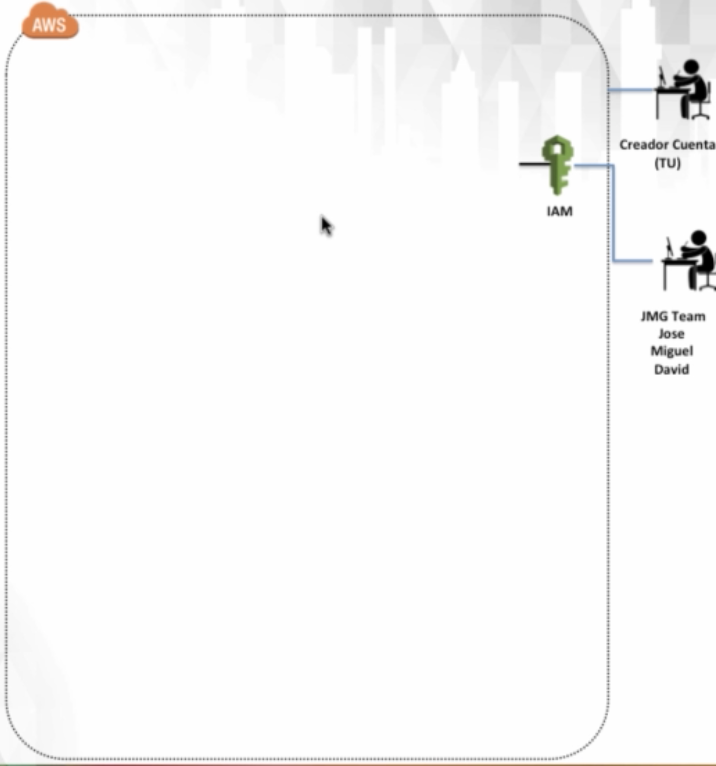
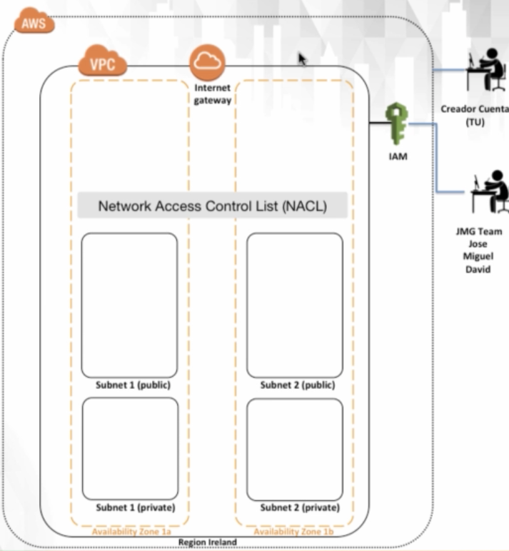
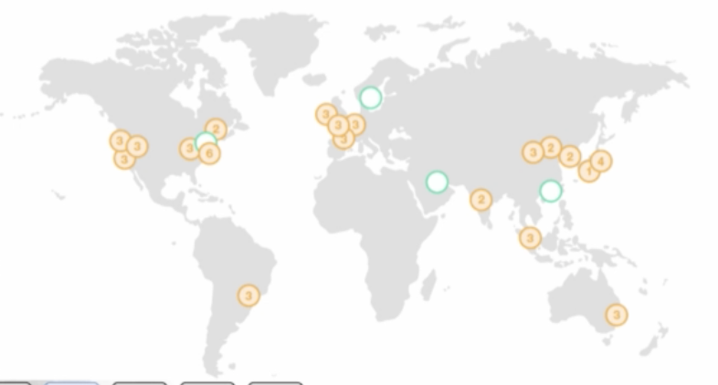
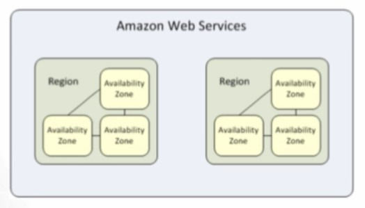
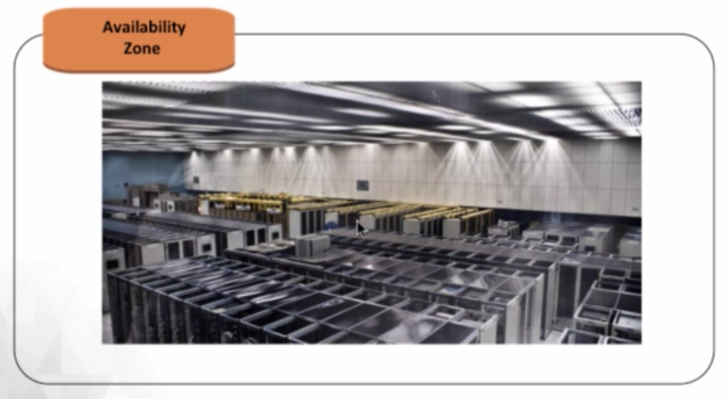
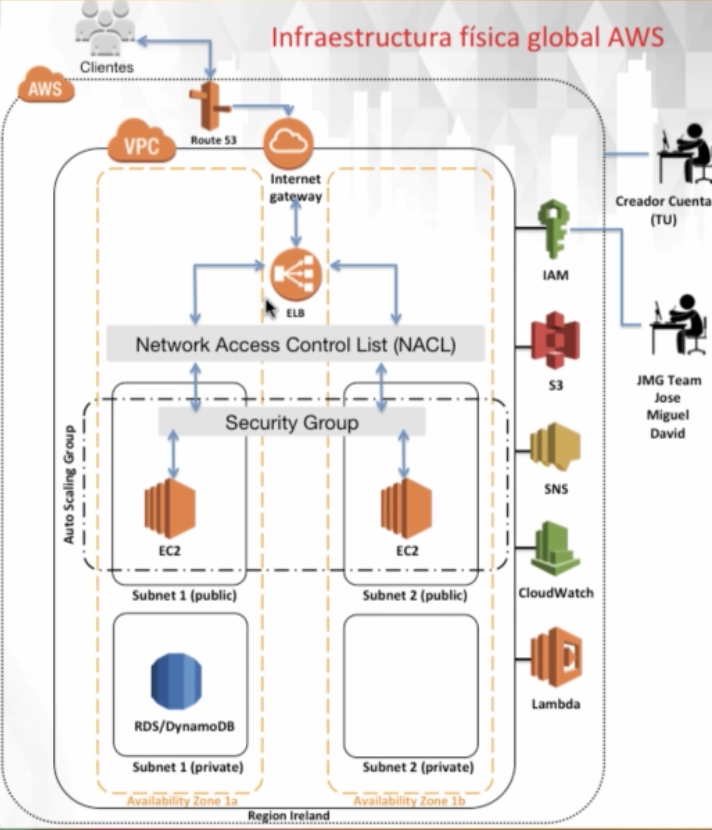

# 4. Virtual Private Cloud (VPC) 01:39:57

* Infraestructura Global en AWS 10:13
* Introducción a VPC 13:14
* Internet Gateways (IGW) 07:43
* Tablas de rutas (RTs) 10:32
* Network Access Control List (NACLs) 23:09
* Subredes 15:18
* Availability Zones (AZs) 19:48

## Infraestructura Global en AWS 10:13

En esta sección vamos a profundizar bastante en el componente estrella de Amazon, que es donde esta la mayoría de la funcionalidad de AWS, porsupuesto hablamos de VPC. 

Hasta el momento hemos constrido esto:

En esta sección construiremos lo siguiente:

###  Temas incluidos en esta lección

* Visión de la infraestructura global de AWS
* Introducción y explicación de las VPCs
* Como viajan los datos a través de AWS:
   * Internet Gateways
   * Tablas de rutas
   * Subredes
   * Network Access Control List (NACL)

### Visión de la infraestructura global de AWS

* Regiones
* Availability Zones (AZs)
* Data Centers

#### Regiones

¿Qué son las regiones de AWS?

* Agrupación de recursos de AWS ubicados en una zona geográfica.
* Diseñado para dar servicio a clientes de diferentes regiones.
* Las regiones forman parte de múltiples zonas de disponibilidad.

Algo muy importante que mencionar ahora es que la infraestructura global de Amazon empieza por las regiones y las regiones son agrupaciones de recursos de AWS ubicados en una zona geográfica en concreto con lo que si le echas un vistazo a este mapa de Amazon, los circulitos que ves son regiones de Amazon los de color naranja y los de color blanco son regiones que se están desplegando o instalando en la actualidad con lo que estas regiones han sido diseñadas para dar servicio a clientes de diferentes regiones con lo que resumiendo las regiones son zonas geográficas donde Amazon provee servicio a sus clientes con lo que si resides en Europa por ejemplo en Irlanda y quieres usar los servicios de Amazon estás de enhorabuena porque Amazon tiene una región con tres centros de datos en Dublín.

Y digo que estoy de suerte y enhorabuena porque si quisiera poner mis instancias o mis servicios en la zona de Dublín, al tener centro de datos Amazon en Dublín la latencia de mi servicio para los clientes de Dublín sería muy pequeña ya que físicamente el centro de datos de Amazon donde voy a albergar mis servicios de Amazon está físicamente en Dublín. Con lo que te estarás preguntando que muy bien estás enhorabuena porque resido en Dublín.

Pero qué pasa para mis clientes que están en Tokio y quieren conectarse al servidor web que voy a poner en la zona geográfica de Dublín.

Pues muy buena pregunta pero durante el transcurso de este curso veremos cómo crear el mismo servidor web que tengo en Dublín.

También en la zona geográfica de Asia para que los clientes de Japón que se conecten a mi servidor web se conecten directamente al servicio al servidor web que tendré replicado en la zona de Japón para que obviamente los usuarios de Japón tengan también una latencia muy pequeña.

Otra cosa muy importante a destacar en este gráfico es que cada región está compuesta por diferentes zonas de disponibilidad y el número denota cuántas zonas de disponibilidad tenemos disponibles por cada región en Amazon. 

Con lo que te estarás preguntando qué es una zona de disponibilidad en AWS.

#### Availability Zones (AZs)

¿Qué son las Availability Zones (AZs) en AWS?

* Zonas geográficamente aisladas dentro de una región que alberga recursos AWS.
* Las zonas disponibles son lugares donde se encuentran los centros de datos físicos de AWS.
* Múltiples AZs en cada región proporcionan redundancia para los recursos de AWS en esta región.

Pues bien estas Availability Zones (zonas de disponibilidad) son realmente zonas geográficamente aisladas dentro de una misma región que albergan recursos de AWS, con lo que realmente estas zonas de disponibilidad son lugares físicos donde se encuentran los centros de datos de AWS.

Pero lo más importante de estas AZs es que múltiples AZs en cada región nos proporcionarán redundancia para los recursos de AWS que pongamos en esa región.

¿Qué significa esto?

En el mapa verás que por ejemplo en la zona de América Latina concretamente en Brasil, tenemos una región de Amazon con un número 3.

Esto significa que tenemos tres centros físicos de Amazon o tres AZs, en otras zonas geográficas tenemos dos y en otras hasta cuatro, pero mínima deberíamos de tener al menos dos AZs por región.

Con lo que entiende que por cada región al menos tendremos dos AZs o dos centros de datos físicamente aislados uno del otro, para proporcionarnos redundancia y alta disponibilidad para nuestros servicios de AWS.

Esto es tremendamente importante y quizás aquí radica el éxito de las soluciones de Amazon, porque seguimos el ejemplo de S3 el servicio de almacenamiento de objetos en Amazon y ponemos por ejemplo un archivo en una zona de disponibilidad dentro de la región de Dublín, que como sabes Dublín tiene tres AZs diferentes, es decir tres centros de datos físicos conectados el uno con el otro. Pues imagínate que una de las AZs se cae porque ha habido un huracán o un incendio o se ha caído el centro de datos. En ese caso no tendríamos ningún problema porque los archivos de S3 se replican dentro de una misma región en las tres zonas diferentes, con lo cual cualquier zona de disponibilidad que se caiga, no habría ningún problema, porque los archivos han sido replicados como digo en otras de las zonas de disponibilidad de la misma región, con lo que el tener diferentes zonas de disponibilidad, nos proporciona redundancia para los servicios que vayamos a instalar en AWS.

Con lo que en resumen las zonas de disponibilidad, nos proporciona la arquitectura en alta disponibilidad y fortunas para todos los servicios que vayamos a poner en AWS.

#### Data Centers

Los Data Centers es donde se encuentra el hardware físico que ejecuta los servicios de AWS.

Y si entramos en cada Availability Zones o zona de disponibilidad, es donde encontraremos ya el centro de datos físico que tiene Amazon, que es realmente donde tenemos físicamente los servidores que almacenan los servicios en Amazon AWS. 

Son todos los servidores los switches de red, el almacenamiento, toda la circuitería se encuentran en un centro físico de Amazon. 

Y si bajamos más de nivel y entramos físicamente al centro de datos de Amazon nos encontramos con todos los servicios disponibles que vamos a crear en estos centros de datos totalmente redundados de Amazon AWS.

Con lo que todos los servicios que vamos a ir instalando, los balanceadores, internet gategay, los usuarios(IAM), los archivos en S3, las instancias EC2, las base de datos RDS que vamos a ir creando, etc. Como digo reside obviamente en un centro de datos físico que te he mostrado anteriormente.

Es decir todo lo que vamos a crear desde la GUI, desde la consola de Amazon, residiera obviamente en algunos de los centro de datos o zonas disponibles que Amazon tiene disponibles por todo el mundo y que obviamente estos centros de datos estarán disponibles en una zona de disponibilidad y esas zonas de disponibilidad están disponibles en las regiones de AWS.

Si estoy en la región de Irlanda, es decir en esta zona de disponibilidad, donde tengo 3 AZs o tres centros de datos diferentes para dotar de alta disponibilidad a los servicios que vaya a albergar en esta zona de disponibilidad, con lo que cuando vaya a crear nuevos servicios en la zona de Irlanda, esos servicios van a quedar albergados en esta región de Europa, que a su vez se crearán en alguna de las tres zonas de disponibilidad que tiene la región de Irlanda y que a su vez se crearán en un centro de datos físicos.

Con esto terminamos este amplio resumen a los servicios de infraestructura de AWS.

### Introducción y explicación de las VPCs

### Como viajan los datos a través de AWS:

#### Internet Gateways

#### Tablas de rutas

#### Subredes

#### Network Access Control List (NACL)

## Introducción a VPC 13:14

## Internet Gateways (IGW) 07:43

## Tablas de rutas (RTs) 10:32

## Network Access Control List (NACLs) 23:09

## Subredes 15:18

## Availability Zones (AZs) 19:48

