# 4. Virtual Private Cloud (VPC) 01:39:57

* Infraestructura Global en AWS 10:13
* Introducción a VPC 13:14
* Internet Gateways (IGW) 07:43
* Tablas de rutas (RTs) 10:32
* Network Access Control List (NACLs) 23:09
* Subredes 15:18
* Availability Zones (AZs) 19:48

## Infraestructura Global en AWS 10:13

* Regiones
* Availability Zones (AZs)
* Data Centers

En esta sección vamos a profundizar bastante en el componente estrella de Amazon, que es donde esta la mayoría de la funcionalidad de AWS, porsupuesto hablamos de VPC. 

Hasta el momento hemos construído esto:

En esta sección construiremos lo siguiente:

### Regiones

¿Qué son las regiones de AWS?

* Agrupación de recursos de AWS ubicados en una zona geográfica.
* Diseñado para dar servicio a clientes de diferentes regiones.
* Las regiones forman parte de múltiples zonas de disponibilidad.

Algo muy importante que mencionar ahora es que la infraestructura global de Amazon empieza por las regiones y las regiones son agrupaciones de recursos de AWS ubicados en una zona geográfica en concreto.

Con lo que si le echas un vistazo a este mapa de Amazon, los circulitos de color naranja que ves son regiones de Amazon y los de color blanco son regiones que se están desplegando o instalando en la actualidad. 

Con lo que estas regiones han sido diseñadas para dar servicio a clientes de diferentes regiones.

Resumiendo las regiones son zonas geográficas donde Amazon provee servicio a sus clientes con lo que si resides en Europa por ejemplo en Irlanda y quieres usar los servicios de Amazon estás de enhorabuena porque Amazon tiene una región con tres centros de datos en Dublín.

Y digo que estoy de suerte y enhorabuena porque si quisiera poner mis instancias o mis servicios en la zona de Dublín, al tener centro de datos Amazon en Dublín la latencia de mi servicio para los clientes de Dublín sería muy pequeña ya que físicamente el centro de datos de Amazon donde voy a albergar mis servicios de Amazon está físicamente en Dublín. 

Con lo que te estarás preguntando que muy bien estás enhorabuena porque resido en Dublín.

Pero qué pasa para mis clientes que están en Tokio y quieren conectarse al servidor web que voy a poner en la zona geográfica de Dublín.

Pues muy buena pregunta, durante el transcurso de este curso veremos cómo crear el mismo servidor web que tengo en Dublín, también en la zona geográfica de Asia, para que los clientes de Japón que se conecten a mi servidor web se conecten directamente al servicio, al servidor web que tendré replicado en la zona de Japón para que obviamente los usuarios de Japón tengan también una latencia muy pequeña.

Otra cosa muy importante a destacar en este gráfico es que cada región está compuesta por diferentes zonas de disponibilidad y el número denota cuántas zonas de disponibilidad tenemos disponibles por cada región en Amazon. 

Con lo que te estarás preguntando qué es una zona de disponibilidad en AWS.

### Availability Zones (AZs)

¿Qué son las Availability Zones (AZs) en AWS?

* Zonas geográficamente aisladas dentro de una región que alberga recursos AWS.
* Las zonas disponibles son lugares donde se encuentran los centros de datos físicos de AWS.
* Múltiples AZs en cada región proporcionan redundancia para los recursos de AWS en esta región.

Pues bien estas Availability Zones (zonas de disponibilidad) son realmente zonas geográficamente aisladas dentro de una misma región que albergan recursos de AWS, con lo que realmente estas zonas de disponibilidad son lugares físicos donde se encuentran los centros de datos de AWS.

Pero lo más importante de estas AZs, es que múltiples AZs en cada región nos proporcionarán redundancia para los recursos de AWS que pongamos en esa región.

¿Qué significa esto?

En el mapa verás que por ejemplo en la zona de América Latina concretamente en Brasil, tenemos una región de Amazon con un número 3.

Esto significa que tenemos tres centros físicos de Amazon o tres AZs, en otras zonas geográficas tenemos dos y en otras hasta cuatro, pero mínima deberíamos de tener al menos dos AZs por región.

Con lo que entiende que por cada región al menos tendremos dos AZs o dos centros de datos físicamente aislados uno del otro, para proporcionarnos redundancia y alta disponibilidad para nuestros servicios de AWS.

Esto es tremendamente importante y quizás aquí radica el éxito de las soluciones de Amazon. 

Si seguimos el ejemplo de S3 el servicio de almacenamiento de objetos en Amazon y ponemos por ejemplo un archivo en una zona de disponibilidad dentro de la región de Dublín, que como sabes Dublín tiene tres AZs diferentes, es decir tres centros de datos físicos conectados el uno con el otro. 

Pues imagínate que una de las AZs se cae porque ha habido un huracán o un incendio o se ha caído el centro de datos. En ese caso no tendríamos ningún problema, porque los archivos de S3 se replican dentro de una misma región en las tres zonas diferentes, con lo cual cualquier zona de disponibilidad que se caiga, no habría ningún problema, porque los archivos han sido replicados como digo en otras de las zonas de disponibilidad de la misma región, con lo que el tener diferentes zonas de disponibilidad, nos proporciona redundancia para los servicios que vayamos a instalar en AWS.

Con lo que en resumen las zonas de disponibilidad, nos proporciona la arquitectura en alta disponibilidad para todos los servicios que vayamos a poner en AWS.

### Data Centers

Los Data Centers es donde se encuentra el hardware físico que ejecuta los servicios de AWS.

Y si entramos en cada Availability Zones o zona de disponibilidad, es donde encontraremos ya el centro de datos físico que tiene Amazon, que es realmente donde tenemos físicamente los servidores que almacenan los servicios en Amazon AWS. 

Son todos los servidores los switches de red, el almacenamiento, toda la circuitería se encuentran en un centro físico de Amazon. 

Y si bajamos más de nivel y entramos físicamente al centro de datos de Amazon nos encontramos con todos los servicios disponibles que vamos a crear en estos centros de datos totalmente redundados de Amazon AWS.

Con lo que todos los servicios que vamos a ir instalando, los balanceadores, internet gategay, los usuarios(IAM), los archivos en S3, las instancias EC2, las base de datos RDS que vamos a ir creando, etc. reside obviamente en un centro de datos físico.

Es decir todo lo que vamos a crear desde la GUI, desde la consola de Amazon, residiera obviamente en algunos de los centro de datos o zonas disponibles que Amazon tiene disponibles por todo el mundo y que obviamente estos centros de datos estarán disponibles en una zona de disponibilidad y esas zonas de disponibilidad están disponibles en las regiones de AWS.

Si estoy en la región de Irlanda, donde tengo 3 AZs o tres centros de datos diferentes para dotar de alta disponibilidad a los servicios que vaya a albergar en esta zona de disponibilidad, con lo que cuando vaya a crear nuevos servicios en la zona de Irlanda, esos servicios van a quedar albergados en esta región de Europa, que a su vez se crearán en alguna de las tres zonas de disponibilidad que tiene la región de Irlanda y que a su vez se crearán en un centro de datos físicos.

Con esto terminamos este amplio resumen a los servicios de infraestructura de AWS.

## Introducción a VPC 13:14

* Definición de las VPCs
* Discución conceptual de las VPCs
* Componentes en las VPCs
* Flujo de datos dentro de las VPCs
* Acceso a las VPCs desde la consola AWS

### Acceso a las VPCs desde la consola AWS

Para acceder a las VPC en la consola de Amazon la encontramos en la Sección **Redes y entrega de Contenido**

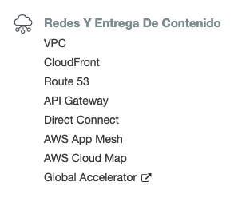

Si damos click en VPC veremos el VPC Dashboard:

### Definición de las VPCs

* ¿Qué es una VPC (Virtual Private Cloud) JMG
   
   * Es una subsección privada de AWS que **TU** controlas y en la que puedes meter los recursos de AWS como instancias EC2 y BD.
   * Tu tienes el control TOTAL sobre quien tiene acceso a los recursos de AWS que vas a instalar dentro de tu VPC.
   
* ¿Qué es una VPC según AWS?

   * La nube privada virtual de Amazon te permite aprovisionar una sección aislada de la nube de Amazon Web Services (AWS) donde puedes iniciar recursos en una red virtual que tu defines.
   * Tendrás control total sobre tu entorno de red virtual, incluyendo la sección de tu propio rango de direcciones IP, la creación de subredes y configuración de tablas de rutas y puertas de enlace de red.
   
**Cuando creas una cuenta AWS, se crea una VPC por defecto**

Por lo que en nuestro VPC Dashboard vemos que ya tenemos un VPC, también vemos que se han creado 3 Subnets, se ha creado 1 Route Tables, 1 Network ACLs, 1 Security Groups, 1 Internet Gateways y 1 DHCP options sets.

AWS crea todo esto para que podamos tener una VPC completamente funcional para poder desplegar instancias y que todo funcione correctamente y **totalmente Gratuita**.

### Discución conceptual de las VPCs

Para entender que es una VPC podemos pensar que es muy similar a la red de nuestra casa.

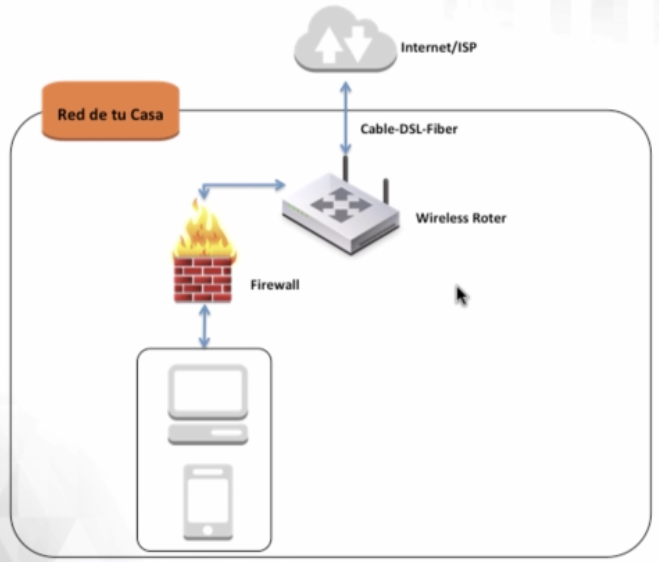

En la red de nuestra casa tenemos cables que vienen de Internet/ISP los cuales se conectan al Router, es posible que tengamos instalado un Firewall para evitar que entre trafico no deseado antes de conectar todos nuestros dispositivos a Internet.

¿Qué pasa si se cae el cable que se conecta desde el Router con el proveedor de Internet?

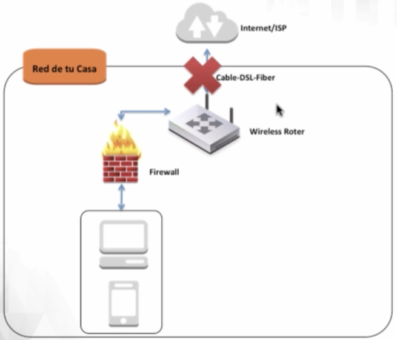

Ninguno de los dispositivos conectados en nuestra red privada en casa podría salir a Internet, pero las maquinas entre si podrían hablar perfectamente ya que estan conectadas a través del Router y la conexión con el Router esta funcionando perfectamente.

¿Qué pasa si lo que se cae es el Router?

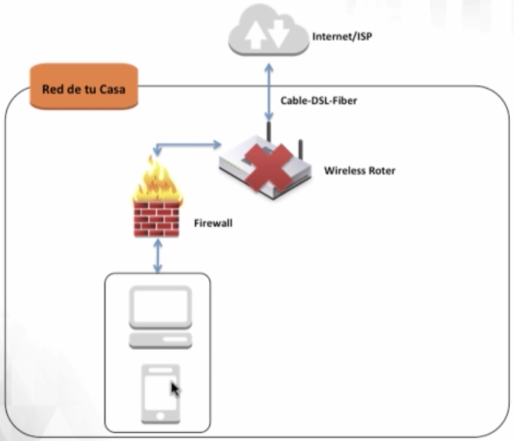   

Que todos los dispositivos conectados al Router no podrían conectarse entre ellos. 

Como ves son posibles escenarios que pueden pasar en tu red virtual en casa muy parecido a lo que es una VPC.

### Componentes en las VPCs

Si te das cuenta los componentes de una VPN son muy similares a los componentes que te he mostrado de tu red privada en casa, tenemos el acceso a Internet el cual se conecta con un **Internet Gateway**, en la conexión de tu casa es el **cable DSL o de fibra**.

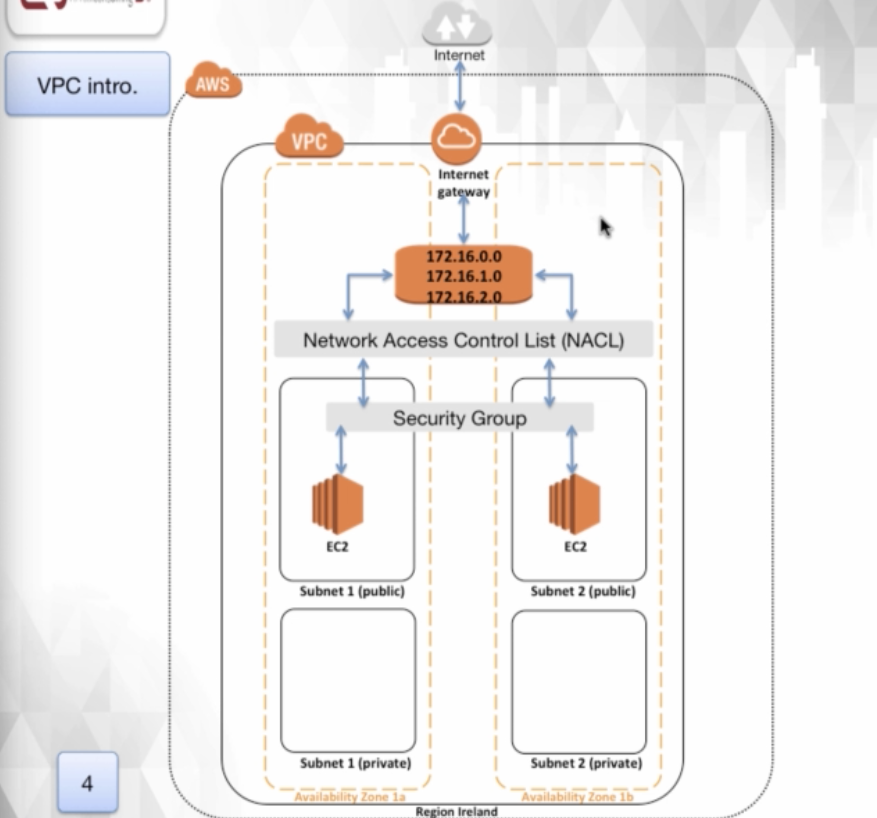 

En seguida tenemos **tablas de rutas** que equivale al router en la red privada en casa.

Después de estas tablas de rutas tenemos en Amazon **Network Access Control List (NACL)** que sería muy similar al **Firewall** que puedes tener en tu red privada en casa.

Y en lugar de tener **PCs o teléfonos inteligentes smartphones** lo que tenemos en nuestra VPC son **instancias de EC2 o máquinas virtuales**.

He querido hacer esta comparación para que no te asustes cuando vayamos a hacer los laboratorios o expliquemos el concepto de la VPC porque realmente estamos hablando de Internet Gateways, de tablas de rutas, de Network Access Control Listy de instancias.

Haciendo esta comparación con tu red privada en casa tendrás más fácil la posibilidad de entender cómo administrar, instalar y gestionar una VPC y todos los componentes dentro de esa VPC en AWS.

### Flujo de datos dentro de las VPCs

Así que el flujo de datos que va a ocurrir en una VPC es muy parecido al flujo de datos que tendrás también en tu red privada en casa.

Es decir si en el EC2 tenemos una instancia la cual quieres salir a Internet para ver una página web esta petición va a pasar por el Network Access Control List que va a decir si este protocolo está abierto o no si está abierto va a pasar a nuestra tabla de rutas que sería como el router que tienes en tu casa y este router se lo va a pasar al Internet Gateway que sería como el cable de ADSL o de fibra que te conecta en la red privade de casa y este conecta con tu proveedor de Internet.

Así que el flujo de datos en una VPC es casi exactamente igual que el flujo de datos que puedas tener desde un dispositivo móvil o un PC portátil en una red privada de tu casa.

**Recuerda**

* ¿Qué es una VPC?

   * La nube privada virtual de amazon te permite aprovisionar una sección aislada de la nube de Amazon Web Services (AWS) donde puedes iniciar recursos de AWS en una red virtual que tu defines.
   * Tendrás control total sobre tu entorno de red virtual, incluyendo la sección dee tu propio rango de direcciones IP, la creación de subredes y configuración de tablas de rutas y puertas de enlace de red.

* Cuando creas una cuenta en AWS, se crea una VPC por defectocon los siguientes componentes que se necesitan para hacerla funcionar:

   1. Internet Gateway (GW).
   2. Una tabla de rutas(con rutas a las subredes por defecto).
   3. Un NACL (con reglas predefinidas para garantizar acceso).
   4. Subredes para provisionar recursos AWS(instancias EC2).
   
## Internet Gateways (IGW) 07:43

* Definición de un IGW
* Funciones de un IGW
* Conexión de un IGW
* Creación de IGW
* Reglas básicas en los IGW

### Definición de un IGW

* ¿Qué es un IGW (**I**nternet **G**ate**w**ay) según JMG
   * Una combinación de hardware y software que proporciona a tu red privada una ruta hacia el exterior(internet) de la VPC.
   
* ¿Qué es un IGW según AWS?
   * Una puerta de enlace de Internet es un componente de tu VPC que escala horizontalmente, redundante y altamente disponible que te permite la comunicación entre las instancias de tu VPC e Internet.
   * No impone restricciones de riesgo de disponibilidad ni de ancho de banda en el tráfico de tu red.
   
**Tu VPC por defecto ya tiene conectado un IGW a internet**

 

### Acceso a IGW desde la consola AWS

En el VPC Dashboard seleccionamos en la lista de opciones **Internet Gateways**

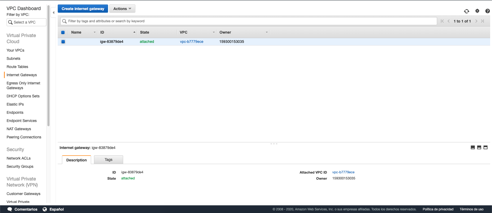 

Se puede observar el ID de la VPC a la cual este IGW esta conectado. El **State attached** significa que esta conectado por un lado a Internet y por otro a nuestra VPC. Por lo que cualquier instancia que pongamos en nuestras subredes tendra entrada y salida a Internet.

Podría desconectar mi IGW de mi VPC si selecciono en el menú **Actions** la opción **Detach from VPC**.

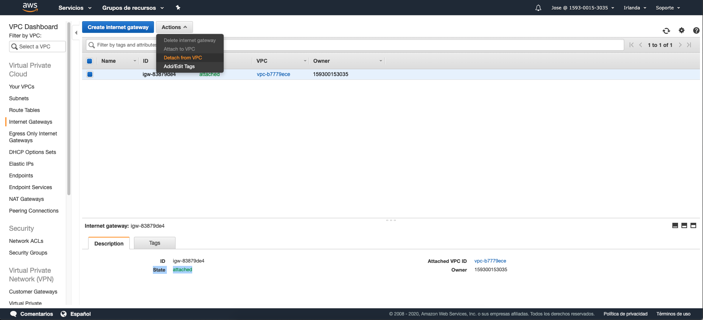 

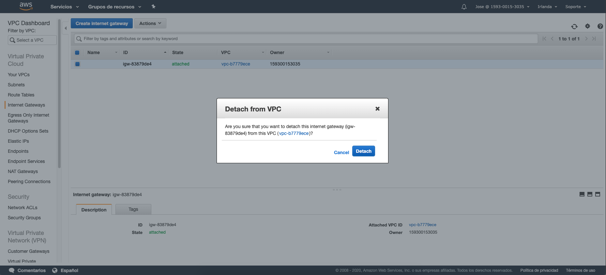 

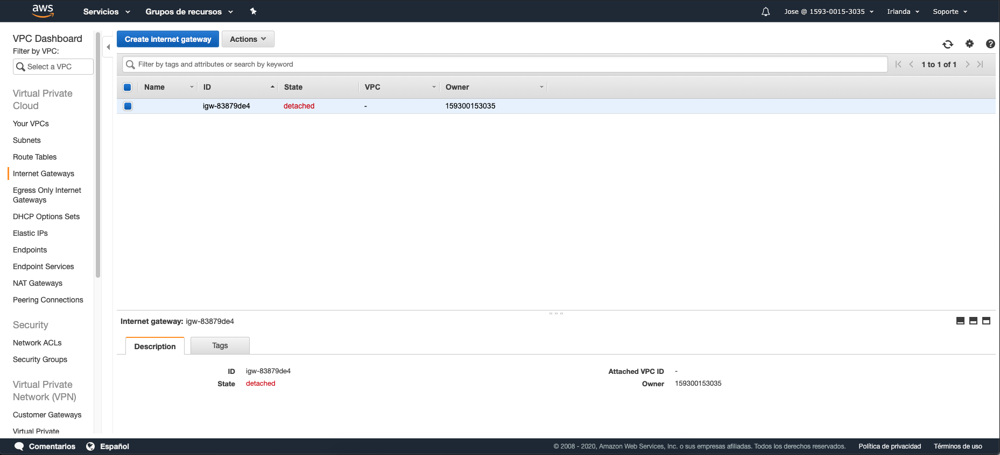 

Realmente lo que ha pasado cuando he desconectado mi IGW, es que el IGW se ha ido como dispositivo de mi VPC, ya no existe. No se puede salir ni entrar a Internet.

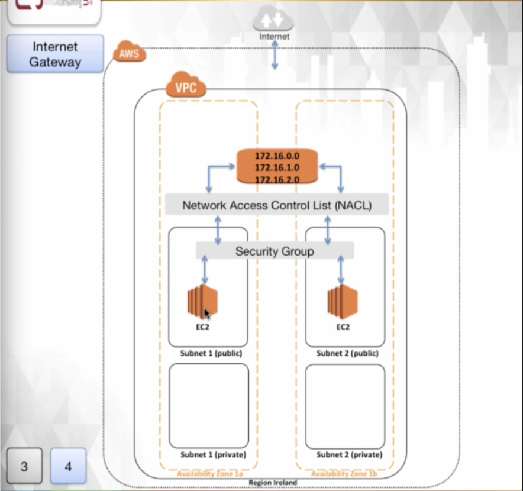 

Realmente el IGW todavía esta en la cuenta gratuita pero ya ya no esta dentro del VPN.

Las dos instancias EC2 que tenemos se pueden comunicar entre ellas por la tabla de rutas pero no pueden salir a Internet. 

### Conexión de un IGW

Vamos a volver a conectar el IGW que tenemos a la VPC

Del menú **Actions** seleccionamos la opción **Attach to VPC**.

 

Se nos pide asociar la VPC.

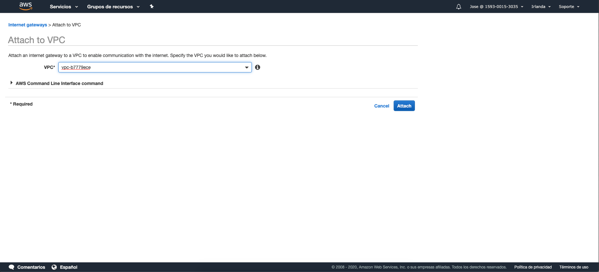 

Y presionamos el botón Attach.

 

Con lo que vuelvo a tener mi IGW asociado a mi VPC, volviendo conexión a Internet.

 

### Creación de IGW

Para crear otro IGW basta pulsar en el botón **Create internet gateway** 

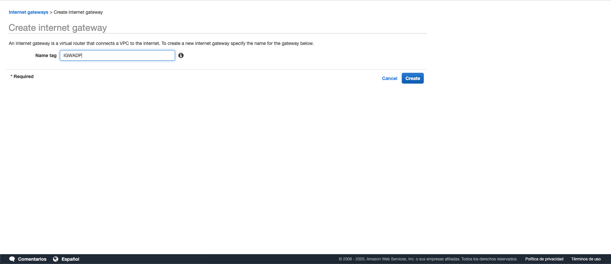 

Nos pide un nombre y pulsamos el botón **Create**

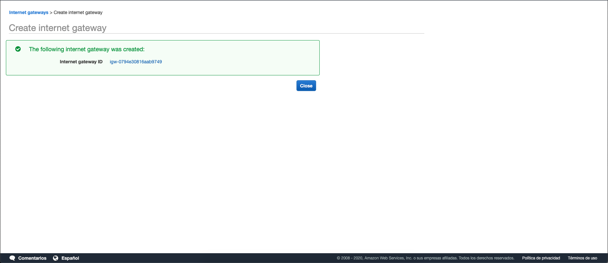 

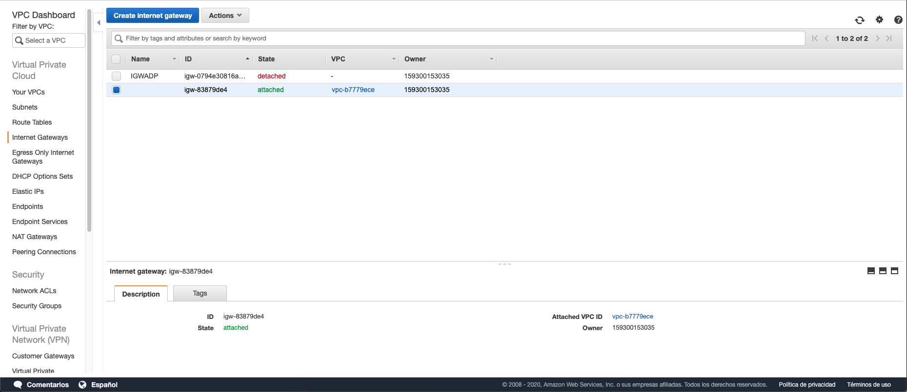 

Acaba de crearse un nuevo IGW su estado es desconectado y puedo conectarlo a otra VPC que pueda tener. En este caso no permitira conectarlo a la misma VPC por que solo puede haber un IGW por VPN. 

 

### Reglas básicas en los IGW

Detalles y reglas de los IGW que necesita saber:

* Solo 1 IGW puede ser conectado a tu VPC a la vez.
* Un IGW no puede ser desconectado de tu VPC mientras haya recursos corriendo (instancias EC2 o base de datos RDS).

## Tablas de rutas (RTs) 10:32

* Definición de una tabla de rutas
* Funciones de las tablas de rutas
* Creando y borrando tablas de rutas
* Configurando nuevas rutas en las tablas de rutas.

### Definición de una tabla de rutas

* ¿Qué es una tabla de rutas según JMG?
   * Una tabla de rutas contiene un conjunto de reglas, llamadas rutas, que se utilizan para determinar hacia dónde se dirige el tráfico de red.
   
**Tu VPC por defecto ya tiene una tabla de rutas llamada principal**

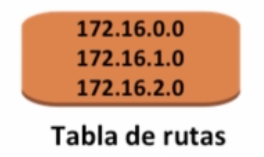 

### Acceso a la Tabla de Rutas desde la consola AWS

En el VPC Dashboard seleccionamos en la lista de opciones **Route Tables**

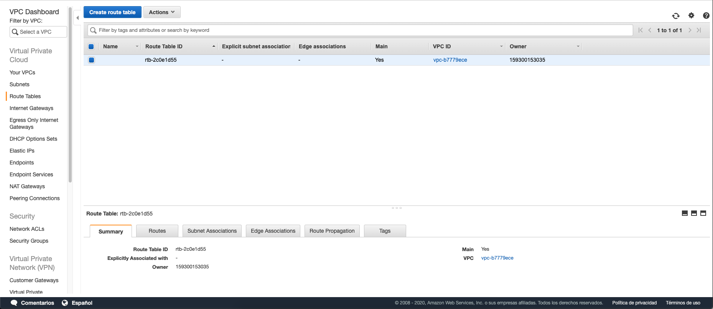 

Sabemos que es la Tabla de Rutas principal por que existe una columna **Main** marcada con **Yes**.

### Funciones de las tablas de rutas

Como vemos en el siguiente diagrama después del Internet Gateway tenemos nuestra tabla de rutas.

 

Así cuando una instancia EC2 requiere alguna solicitud web, el dato llega desde Internet pasa por el Internet Gateway y es la tabla de rutas la que decide a que subred envía el paquete. Recordemos que las tablas de rutas equilaen a nuestro router en la red privada de casa.

La tabla de rutas es la que provee la conexión a todas las subredes dentro de la VPC

Si observamos en el VPC Dashboard la sección Route Tables, y dentro vemos la pestaña Routes, veremos lo que esta adjuntado en esa tabla de rutas y por donde pasarán los paquetes.

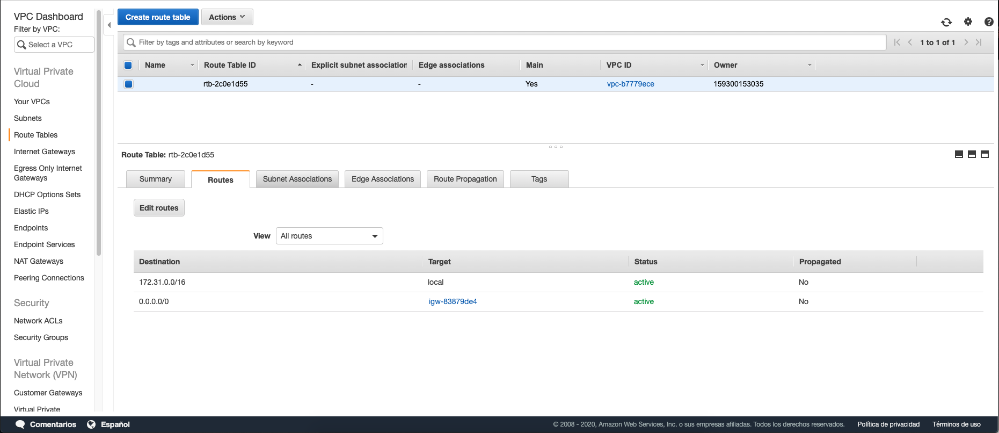 

Por un lado tenemos: 

`0.0.0.0/0  igw-83879de4	active   No`

Esto representa al IGW que tenemos en nuestra VPC. En el diagrama representaría la línea que conecta el IGW con la tabla de rutas. Estamos diciendo que todo lo que vaya a `0.0.0.0/0` (Internet) lo mandemos a traves de `igw-83879de4` (IGW).

La otra línea que tenemos:

`172.31.0.0/16	   local	   active   No`

Representa la dirección IP de nuestra VPC, Amazon nos ha asignado `172.31.0.0/16`. En el diagrama esta línea representaria las dos flechas que salen de la tabla de rutas.

¿Qué pasaría si desconecto mi IGW, que se mostraría en la línea?

`0.0.0.0/0  igw-83879de4	active   No`
   
Vamos a desconectar el IGW asociado a la VPN.

Desde la propia línea puedo pulsar en el id del IGW y me abrira una nueva pestaña con la información del IGW, procedemos a desadjuntar.

 

En nuestro diagrama lo que acabamos de hacer queda representado así:

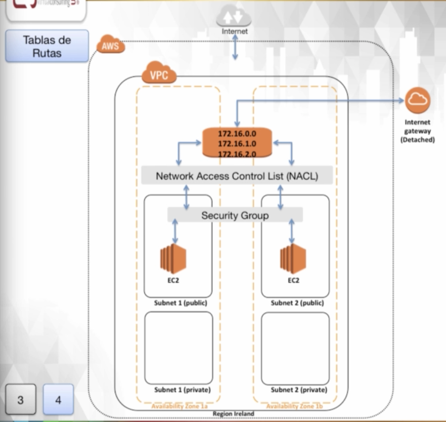 

Es decir hemos desconectado nuestro IGW por lo que ya no pertenece a nuestra VPC, pero sigue conectado en las tablas de rutas.

Si refresco la página de Route Tables veremos lo siguiente:

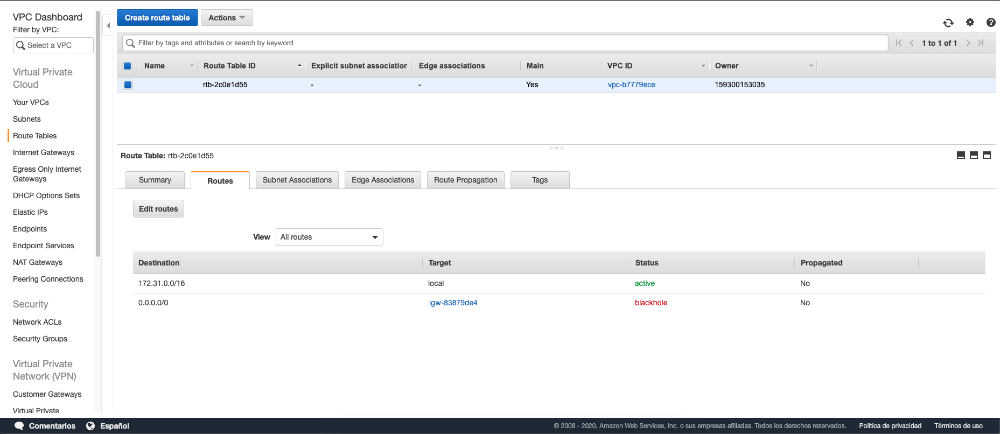 

Se ha producido un **Black Hole** un agujero negro. Si las instancias EC2 quisieran ir a internet lo harían a través del IGW el cual esta desconectado, por lo que no podrían. Para arreglar el problema bastaria conectar nevamente el IGW a nuestra VPC.

Anteriormente habímos creado un segundo IGW que es el que adjuntaremos a nuestra VPC.

Una vez hecho esto en nuestro díagrama tendríamos un IGW dentro de nuestra VPN pero nuestra tabla de rutas estaría apuntado todavía el primer IGW.

Por lo que para añadir el segundo IGW que acabamos de adjuntar a la VPC debemos editar las tablas de ruta pulsando el botón **Edit routes**.

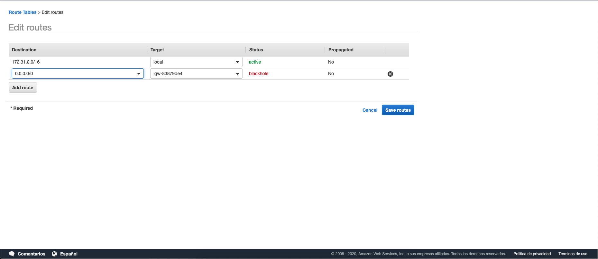

Aquí modificamos el IGW que tenemos por el otro y presionamos el botón **Save routes**

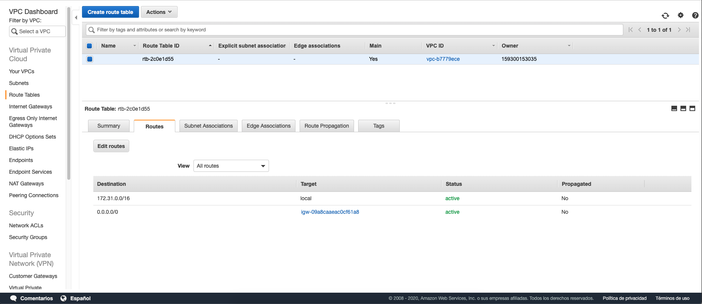

Con lo que nuestro **Black Hole** desaparece ya que hemos asignado el IGW que esta adjuntado a Internet. Representado en nuestro diagrama tenemos:

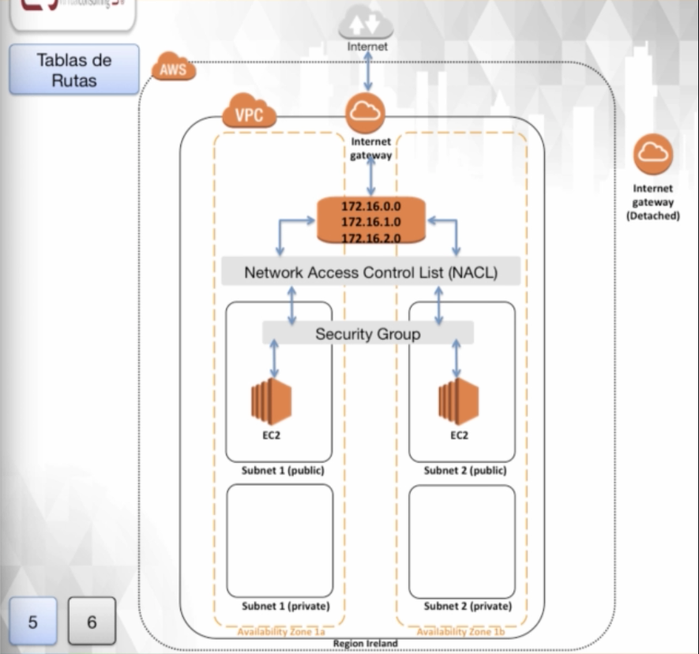

Tenemos el nuevo IGW conectado a nuestra tabla de rutas y el anterior IGW desconectado de la tabla de rutas. Con lo que hemos restaurado la conexión a Internet a través de un nuevo IGW. 

### Detalles y reglas que debes conocer sobre las tablas de rutas:

* A diferencia de los IGW, puedes tener múltiples tablas de rutas activas en tu VPC.
* No puedes borrar una tabla de rutas si esta tiene dependencias como subredes asociadas.

### Creando y borrando tablas de rutas

Para comprender lo anterior vamos a crear una nueva tabla de rutas, pulsando el botón **Create route table** 

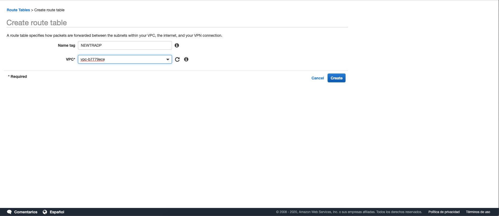

Ingresamos un nombre y la adjuntamos a la única VPC que tenemos, presionamos el botón **Create**.

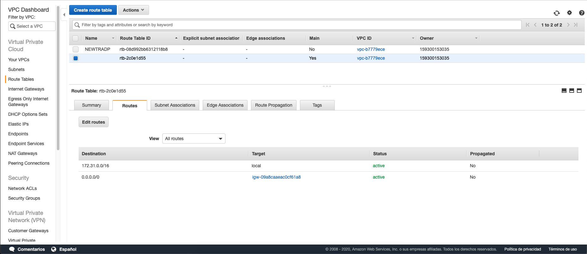

Con esto tenemos nuestra nueva tabla de rutas la cual no es principal ni tampoco tiene asociada una subred. Si la seleccionamos veremos que no esta conectada a ningún IGW, como si la tiene la primer tabla de rutas.

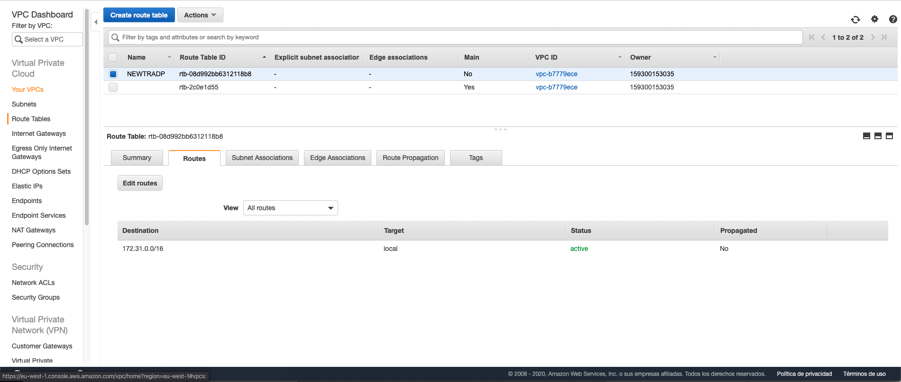

Como hemos visto en las reglas de las tablas de rutas **No puedes borrar una tabla de rutas si esta tiene dependencias como subredes asociadas**, vamos a intentar borrar nuestra primar tabla de rutas la que si tiene asociado el IGW. Seleccionando la opción **Delete Route Table** 

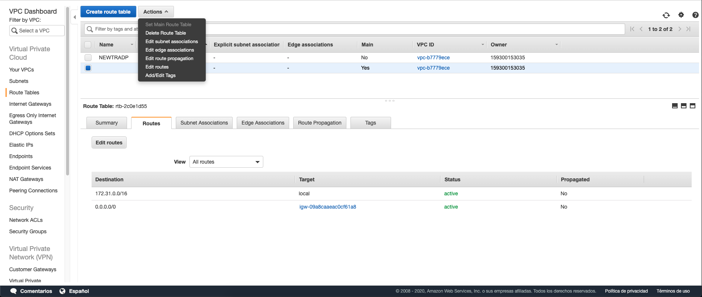

Se nos indica que no es posible eliminar esta tabla de rutas.

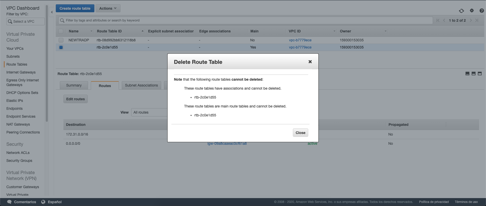

Probemos a eliminar la otra tabla de rutas.

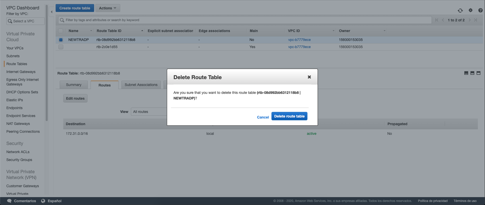

La hemos podido eliminar sin ningún problema: 

Con lo que debemos tener muy claro que a diferencia de los IGW que solo se permite tener uno por VPC, podemos tener multiples tablas de rutas, pero no pueden ser eliminadas si estas tiene dependencias.

## Network Access Control List (NACLs) 23:09

* Definición de un NACLs
* Función de los NACLs
* Creación de un NACLs
* Gestión de reglas en los NACLs

### Definición de un NACLs

* ¿Qué es un NACLs según JMG?
   * Una lista de control de acceso a la red (NACLs) es una capa opcional de seguridad para tu VPC que actua como un firewall para controlar el tráfico dentro y fuera de una o más subredes.
   
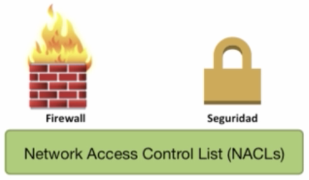

**Tu VPC por defecto ya tiene una NACLs asociada con las subredes**

### Acceso a los TNACLs  desde la consola AWS

En el VPC Dashboard en la sección de **Security** seleccionamos en la opcion **Network ACLs**

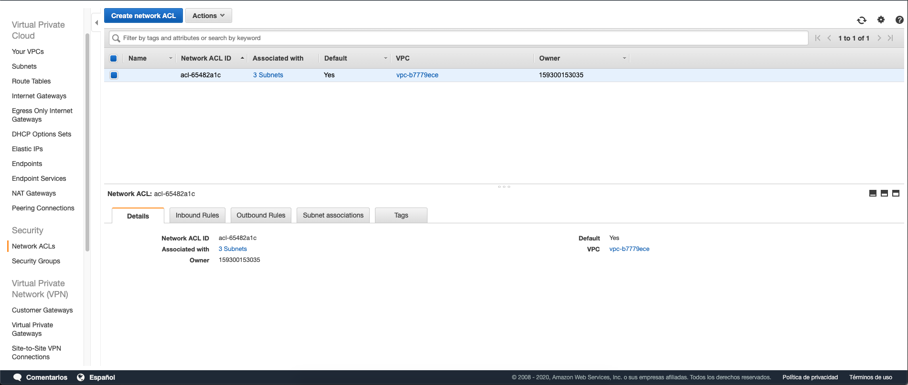 

Como podemos ver tenemos nuestra NACL por defecto asociada con nuestras tres subredes que también se crearon por defecto y no indica que esta asociada a nuestra VPC.

Si marcamos nuesta NACL y damos clic en la pestaña **Subnet associations** veremos la lista de nuestras subredes asociadas.

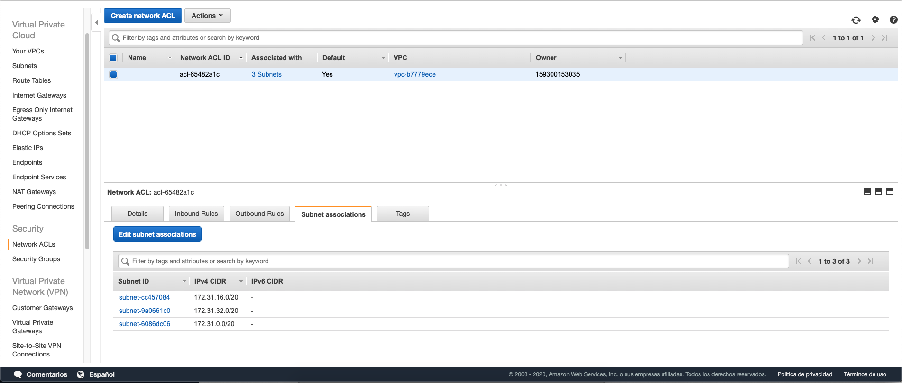 

Podemos apreciar los **ID** y los **CIDR** de cada subred.

### Función de los NACLs

En nuestro diagrama podemos apreciar claramente donde se ubican las NACLs. Se situan entre las tablas de rutas y nuestras subredes que es donde pondremos nuestras instancias EC2 y nuestras BD. 

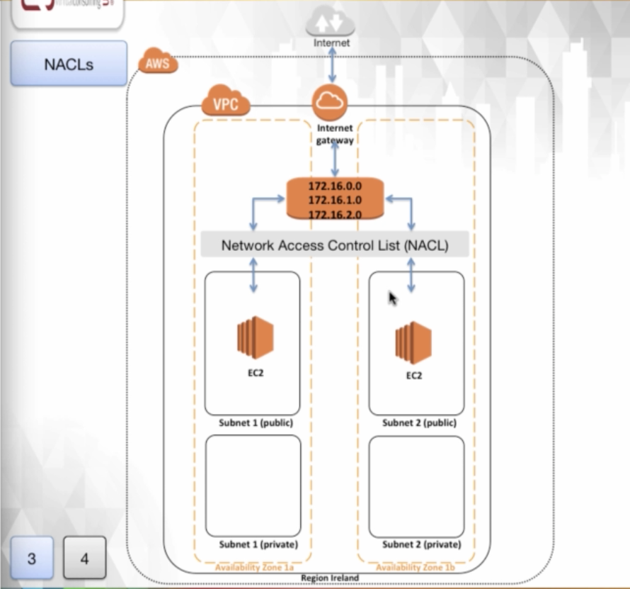

Cuando el trafico entra por Internet a través del IGW llega a las tablas de rutas que definen a que red envíar el trafico y justamente antes de que la subred acepte el trafico golpea en Network Access Control List(NACL), es decir que si el paquete es aceptado entrara a la subred y si no hara un drop  o descarta el paquete que no fue aceptado por nuestros NACLs. 

Lo mismo ocurre en sentido inverso es decir si la maquina virtual o instancia quiere comunicarse con Internet, el paquete se manda a la NACL la cual verificara si el paquete debe o no salir si no lo esta el paquete se descartara y si si lo esta el paquete llegara a la tabla de rutas de allí al IGW y de allí a Internet.

### Reglas en los NACLs

Por lo que es muy importantye entender que los NACLs tienen dos tipos de reglas:

* **Reglas Inbound**: Son las reglas que se aplican al trafico que entra de Internet hacia nuestras subredes
* **Reglas Outbound**: Son las reglas que se aplican al trafico que sale de nuestras subredes a Internet

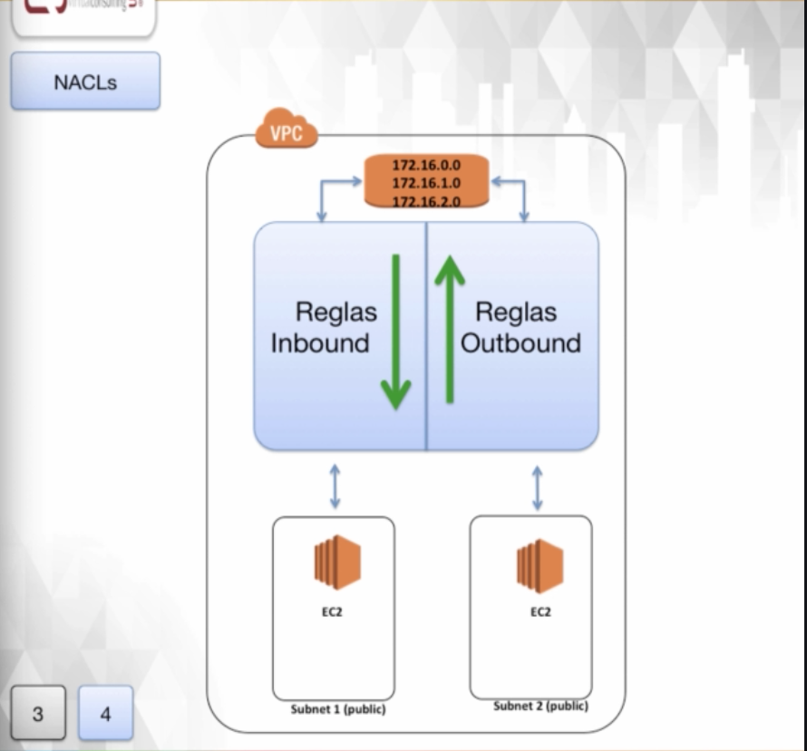

Estos dos tipos de reglas se pueden complicar por que podemos tener diferentes protocolos y puertos en las reglas Inbound de los que se aplican en las reglas Outbound. 

**El NACL creado por defecto permite todo el trafico Inbound y todo el trafico Outbound**.

Esto lo podemos ver en la consola si seleccionamos las pestañas **Inbound Rules** y **Outbound Rules**.

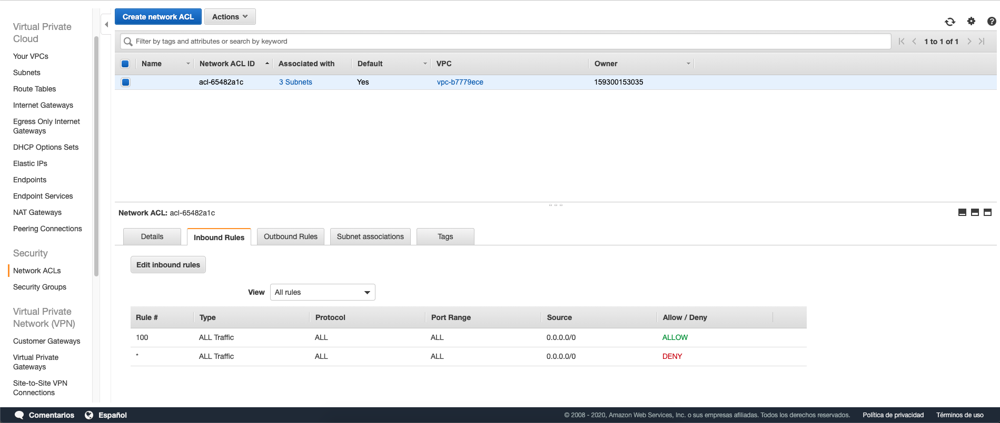

Tenemos una regla que nos permite todos los protocolos y todos los puertos desde/hacia Internet. Por lo que esta permitido que entre y salga TODO a través de nuestro NACL.

La regla tiene un número 100 y es explicitamente valuada en el primer orden de las reglas Inbound y Outbound. 

Si se quiere proporcionar un nivel de seguridad extra en las subredes tendremos que cambiar las reglas Inbound y Outbound para nuestra NACL por defecto . 

### Como funcionan las reglas

¿Cómo funcionan estas reglas?

Estas reglas tanto en los Inbound como en los Outbound gobernaran como funcionan las reglas en los NACLs. 

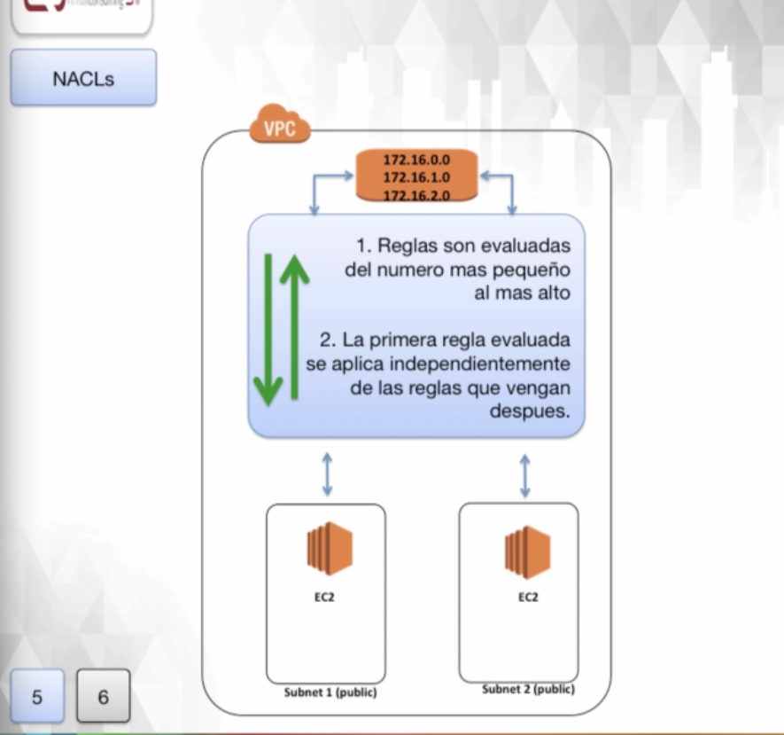

1. Las reglas son evaluadas del número mas pequeño al mas alto.
2. La primera regla evaluada se aplica independientemente de las reglas que vengan después.

Actualmente tenemos dos reglas en la pestaña Inbound Rules

1. La regla con el No. 100 permite todo el tipo de trafico, todo el tipo de protocolos y todos los puertos desde cualquier fuente, marcada como ALLOW.  
2. La regla con `*` conocida como **Regla Catch-All**, indica que no podemos cambiar, borrar o editar esta regla, marcada como DENY lo que significa que deniega cualquier fuente, de cualquier puerto, protocolo y tipo de tráfico. El asterisco indica que esta regla sera la que se tome para cualquier otro protocolo que no cumpla con las reglas anteriores.

Si explicitamente no permitieramos el trafico, es decir si no tuvieramos la regla 100, todo el trafico sería denegado.

Vamos a presionar el botón **Edit inbound rules** 

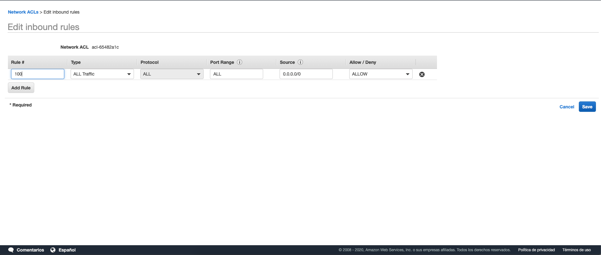

La marcamos como DENY, presionamos la X para eliminarla y presionamos el botón **Save** eliminamos la regla No. 100.

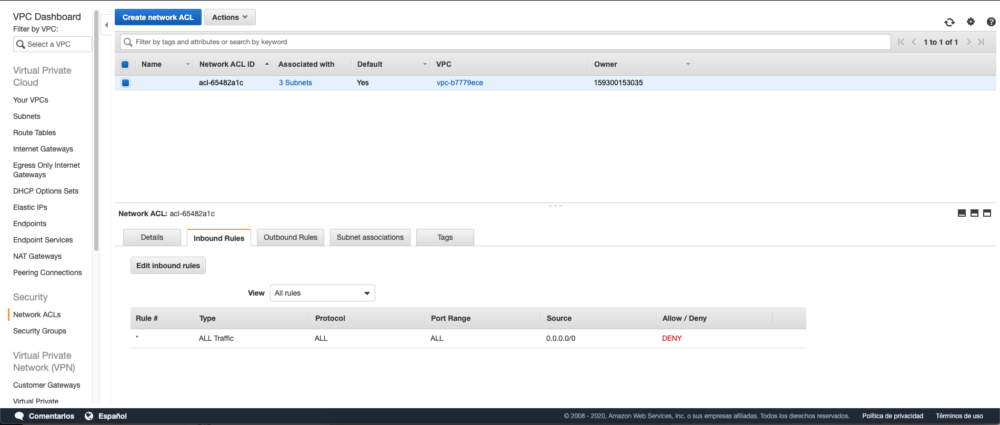

Lo que acabamos de hacer es que todos los paquetes que vayan a entrar a la subred van a ser denegados porque hay explícitamente una regla llamada **Catch-All** con asterisco que va a denegar cualquier protocolo de el tráfico de cualquier tipo y de cualquier fuente. Ahora mismo nadie podría entrar a mi subredes porque acabo de borrar la regla que permite cualquier tráfico y como no puedo borrar la regla **Catch-All**  obviamente todo el tráfico entrante será denegado por defecto en las subredes.

Vamos a arreglar un poquito este desaguisado añadiendo una regla que permita el tráfico entrante a la instancia de la subred  del tipo 80 para que la gente de fuera pueda ver mi servidor web.

Presionamos en el botón **Edit inbound rules**.

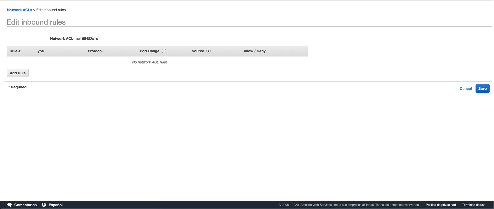

Voy a añadir una regla con un número 80 que va a ser del tipo HTTP le digo **Save**.

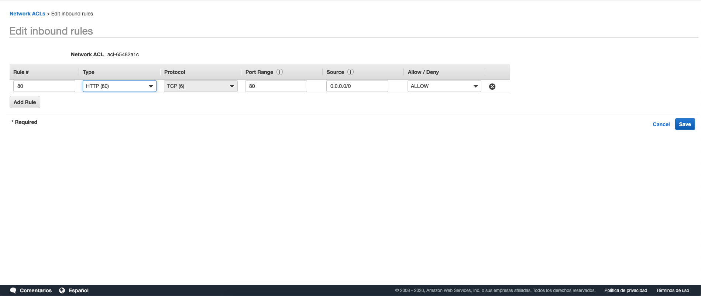

Y como ves ahora mismo estaría permitiendo el tráfico entrante desde internet a mi su red en la instancia sólo para el tráfico HTTP.

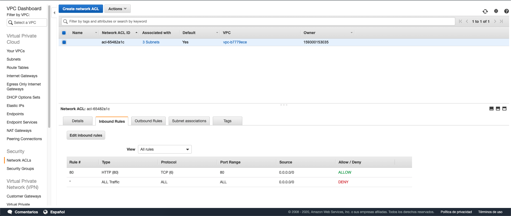

Lo demás obviamente se sigue denegando.

Recuerda que NACL va a evaluar el tráfico siempre desde el número de reglas más pequeño al número de reglas más alto en este caso el número más pequeño es el 80 con lo cual el tráfico que llega de Internet del tipo HTTP sería aceptado por mi NACL en sus redes.

Pero para que entiendas bien esta regla número uno que repito las reglas son evaluadas del número más

pequeño el número es alto.

Vamos a volver a Editar las reglas Inbound y vamos a añadir otra regla esta vez con un número más alto 90 del tipo HTTP también.

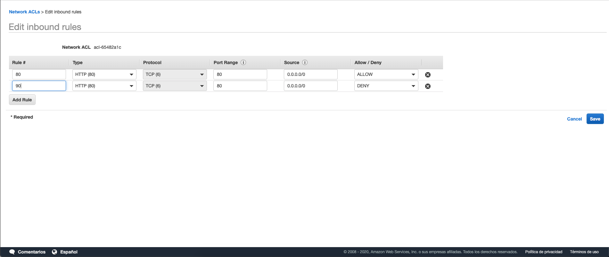

Importante a esta regla que estamos añadiendo le vamos a decir DENY y presionamos el botón **Save**.

Y qué crees que pasará ahora.

Tenemos una regla con el número 80 que permite el tráfico entrante de Internet a la subredes a la instancia por el puerto 80 por el puerto web y tenemos otra regla con el número 90 que deniega el mismo tráfico, el tráfico HTTP.

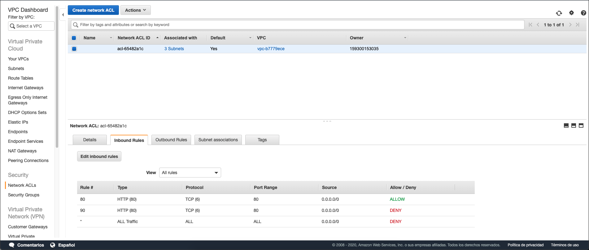

Qué crees que pasará.

Podré ver mi servidor web desde internet o no podré ver mi servidor web desde Internet.

Esa sería la pregunta para ti, si tu respuesta es que estoy permitiendo ver mi tráfico web, mi servidor web desde Internet, estás en lo correcto, porque la primera regla es que las reglas son evaluadas del número más pequeño al número más alto.

Cuál es la regla con el número más pequeño 80. El tipo de tráfico es el HTTP y permitó obviamente este tráfico, por lo cual si tengo otra regla que la deniega, esta regla no se aplicaría.

Así que recuerda, la regla inmediatamente aplica el tráfico y se ejecuta con independencia de las reglas que vengan a posteriori.

En este caso la regla que viene a posteriori es denegar el tráfico HTTP o el tráfico web.

Pero como ya lo he permitido con la regla 80 la aplico y se ejecuta, con lo cual podrás entrar a nuestro servidor web.

Vamos a complicarlo más y voy a editar otra vez las reglas inbound y esta regla que deniega el tráfico HTTP con el número 90 le voy a poner el número 70.

Voy a salvar estas reglas y vamos a ver qué pasará ahora.

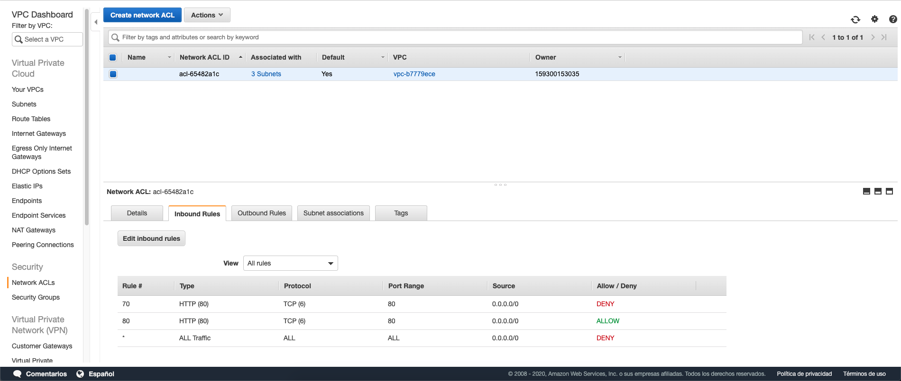

Podríamos ver nuestro servidor web desde internet o no, esta sería nuevamente otra pregunta para ti.

Si ha dicho que ahora nadie podrá ver nuestro servidor web, nuestro tráfico web o nuestra página web, estás en lo correcto porque la regla número 70 que es la primera con el número más pequeño es ejecutada primero y decimos DENY, denegar, con lo cual aunque tengas una regla posterior que permite ese tráfico ya te ha denegando en la regla 70.

Esto es muy importante para que entiendas el tema de las propiedades y quién es evaluada y ejecutada antes.

Pero antes de hablar de estas NACL por defecto y NACL nuevas vamos a cambiar las reglas para que puedan entrar vía HTTP a mis servidores web con lo que cambiando el número de 70 a 90 se vuelve a permitir tráfico desde internet a mi servidor web via HTTP puerto 80.

### Creación de un NACLs

Hablemos ahora de la NACL por defecto que tenemos creada en nuestra VPC y de las NACL nuevas que vayas a crear en tu VPC.

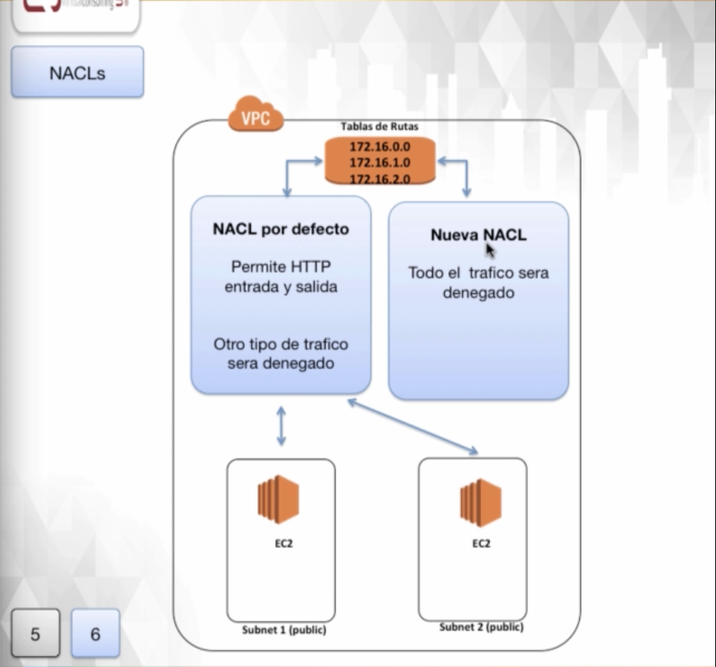

Tenemos una NACL por defecto pero también podemos crear una NACL nueva haciendo clic en la opción **Create network ACL**

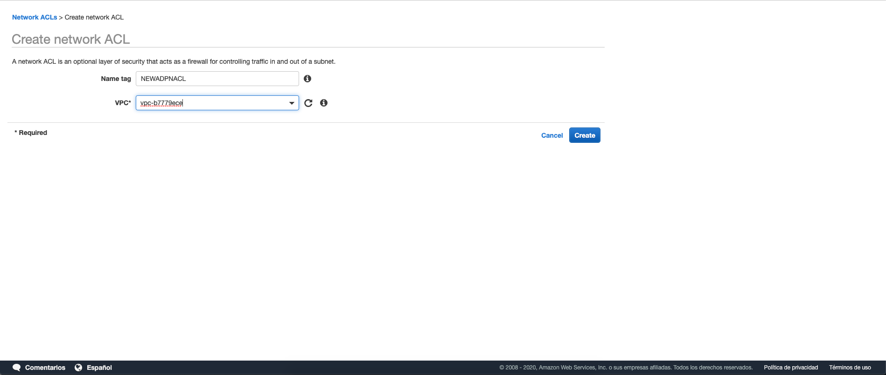

Le damos un nombre y la asociamos a nuestra VPN y presionamos el botón **Create**.

Como vemos tenemos una nueva NACL que se nos ha creado en nuestra VPC. Por defecto cuando cuando se crea una nueva NACL todo el trafico será denegado.

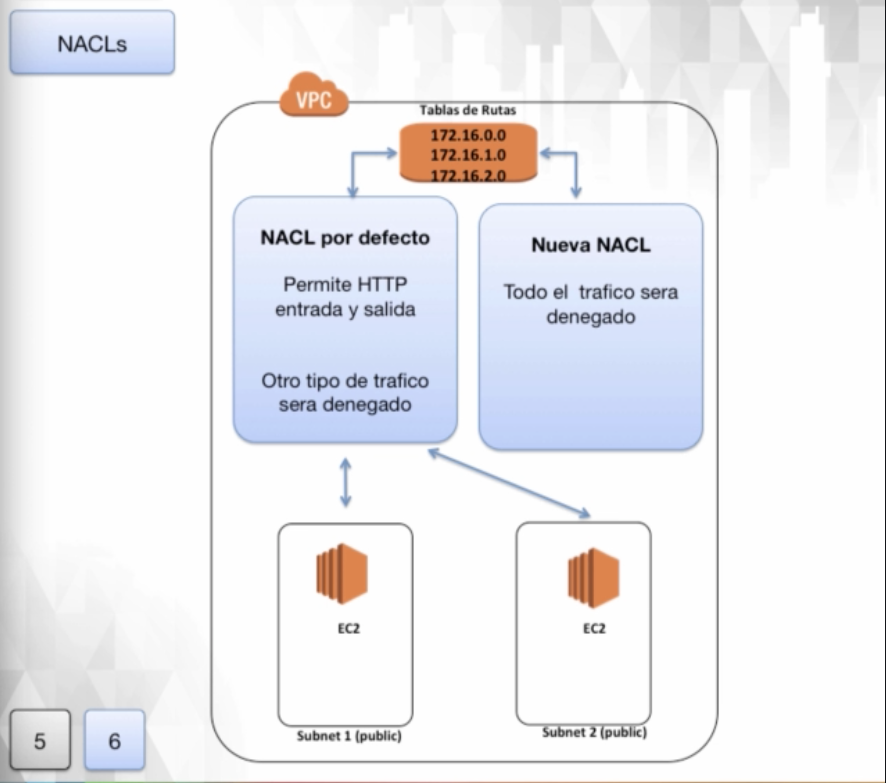

Tanto en la pestaña Inbound como en la Outbound.

Cualquier nueva NACL que crees denegara tanto el tráfico entrante, como el tráfico saliente, va a denegar todo el tipo de tráficos, con lo que todo es denegado nadie puede entrar a sus redes y dentro de sus redes nadie puede salir a Internet.

Sin embargo el NACL por defecto tenía una regla Inbound de acceso a todo el tráfico, y Outbound daba acceso también a todo el tráfico, este detalle es muy importante recordarlo siempre que empieces con las NACL en AWS, en caso de que tengas alguna restricción o errores de conexión a tus instancias o desde tus estancias hacia afuera, siempre echa un vistazo a esta NACL porque es muy probable que el problema esté en estas reglas tanto Inbound como Outbound 

La NACL por defecto tiene asociada tres subredes, están asociadas a la NACL por defecto, con lo cual permitimos la entrada y la salida de HTTP y todo otro tipo de tráfico será denegado en la regla Inbound.

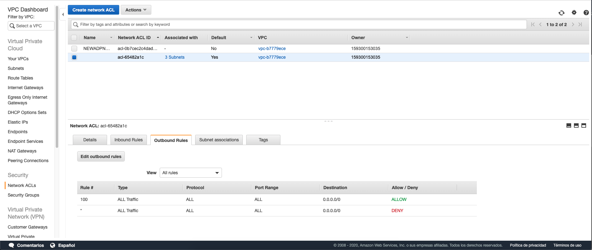

Pero si asociamos estas tres subredes a la nueva NACL qué crees que pasará.

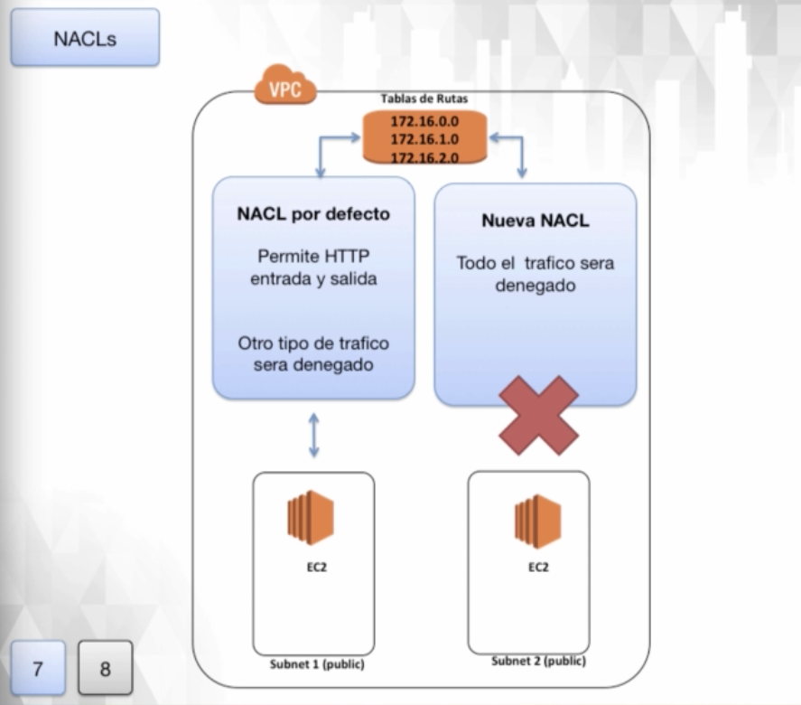

La respuesta, se denegara todo el tráfico entrante y saliente. Porque como vimos anteriormente la NACL tiene una regla de denegar todo el tráfico Inbound y denegar todo el tráfico saliente Outbound.

Te estarás preguntando cómo asociar subredes a las NACLs pues es bastante sencillo.

Si quiero asociar una subred a la nueva NACL lo que tendré que hacer es primero, presionar la pestaña de **Subnet associations**  

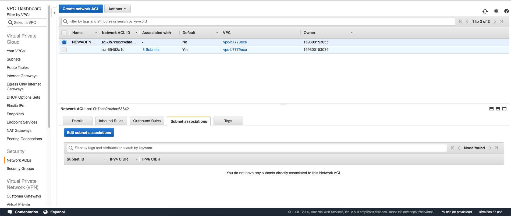

Como vemos no tenemos asociada ninguna subred presionamos el botón **Edit subnet associations**

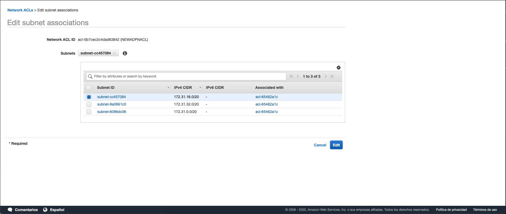

Seleccionamos la primer subred y presionamos el botón **Edit**

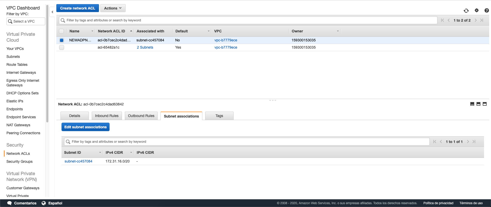

Vemos como mi primer NACL que tenia asociada 3 Subredes ahora ya solo tiene asociada dos y la otra fue la que se asocia a la nueva NACL. Y como vemos esta subred no permite ningun trafico entrante ni saliente:

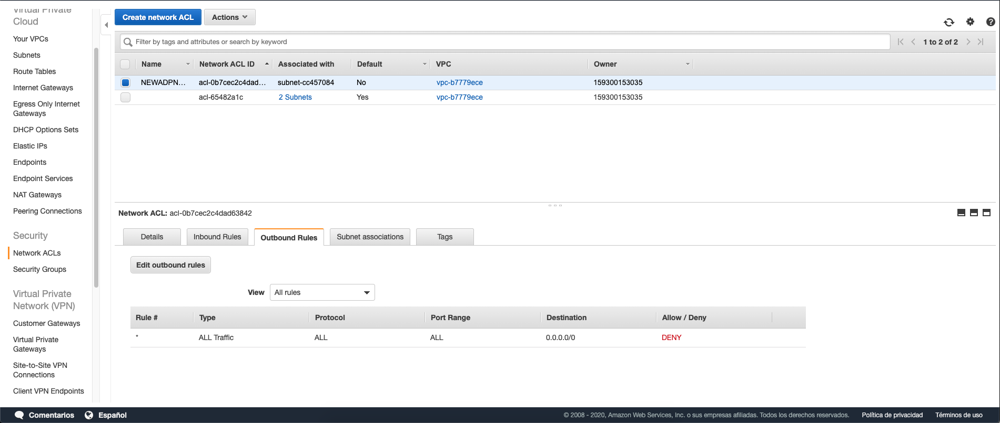

voy a hacer estomagante para que veas la pestaña de Sumner Asociation

voy a seleccionar esta pestaña de y voy a hacer click.

Como ves que no hay ninguna red social todavía voy a hacer clic en edit para asociar una de sus redes

en concreto esta primera de salvar fíjate muy bien en esta columnita asociada con que el 3K meados y

el cero cambiará a 1 en cuanto termine.

Ahí lo tienes como es acabo de asociar una nueva red esta red a esta nueva naquel y como ves esta su

red no permite ningún tráfico entrante ni ningún tráfico saliente.

Bien si quisiera permitir algún tráfico a esta red que asociado con esta nueva naquel entraría a la

pestaña Dinh vamos diría editar y voy a añadir una regla con el número 90 que permita por ejemplo el

tráfico.

Esta vez pacer el tráfico https puerto seguro para mi servidor web protocolo HTTPS.

Vamos a poner el sol que sería 0.0 punto cero punto cero barra cero es decir cualquier fuente y le voy

a permitir este tráfico igual seleccionó alago y guardo esta nueva regla como veis ahora estoy permitiendo

para esta nueva naquel que el tráfico entrante de Internet se ha permitido para el protocolo HTTPS que

en concreto es el protocolo 4 4 3.

Por supuesto tenemos que hacer lo mismo para la regla saída porque el tráfico entra pero también tiene

que volver con lo cual tenemos que añadir también la regla de acceso por el protocolo HTTPS.

4 4 3 en la tabla abajo si decimos editar añadimos la regla 90 para el tráfico https

aquí está con el destino 0.0 punto cero punto cero barra cero y con la opción de Alou le decimos salvar

ya tenemos también que el tráfico https pueda salir desde mi su red hacia afuera con lo que ahora sí

vuelvo a la presentación y sigo la página siguiente.

Estoy permitiendo tráfico HTTP de entrada y salida.

Para mí su red que acabo de asociar a esta nueva naquel y por supuesto la regla Cacheiro va denegar

cualquier tráfico de salida y cualquier tráfico de entrada es decir solo voy a permitir la entrada y

la salida del protocolo HTTPS para esta su red en concreto.

Con esta nueva naquel bien si seguimos con la presentación se que hemos dedicado más tiempo de lo que

tenía pensado en esta parte pero la seguridad de tu entorno NWS es primordial.

No basta con diseñar una solución que funcione sino que hay que diseñar una solución que funcione y

a la vez sea muy segura.

Y por supuesto hay soluciones que son más seguras que otras.

Por eso es muy importante que entiendas bien cómo se aplican las reglas en los anaqueles y cómo configurar

bien estas reglas de acceso a tus subredes con lo que cuando empecemos a desplegar instancias bases

de datos esta parte se va a convertir en primordial que entiendas para obviamente poder hacer trabes

sutil con lo que asegúrate de configurar bien las reglas inbound y Abán porque no solamente vas a aumentar

la seguridad de tu entorno en este caso de tus redes sino que además vas a tener menos problemas para

hacer Travel sútil en los flujos de datos tanto desde Internet hacia adentro como desde fuera hacia

Internet por lo que para terminar resumamos que son las naquel.

Recuerda que es una capa opcional de seguridad con lo cual puedes permitir perfectamente acceso a todo

el tráfico a tus redes o por consiguiente si quieres limitar cualquier tipo de tráfico tendrás que jugar

con estas reglas que te acabo de enseñar tanto en la opción de inbound como en la opción de Avan.

Aunque mi sugerencia y una mejor práctica es que uses los naquel para permitir sólo el tipo de tráfico

que necesitas no que permitas todo el tráfico así que limita ya el acceso.

Inbound ya van a tu subredes para sólo el tráfico que necesitas que esas instancias que están en la

subredes necesiten ver y por supuesto recuerda estos detalles importantes.

Número 1.

Reglas son evaluadas del número menor al número mayor como el más visto.

Regla número 2 la primera regla se aplica independientemente de las reglas que vengan después.

Regla número 3 en la que por defecto permite todo el tráfico a todas las redes.

Y Regla Número 5 una red sólo puede ser asociada a una naquel.

Si recuerdas cuándo a Sophie una de las subredes a éste no naquel automáticamente borró esa su red que

estaba asociada ya a la naquel por defecto y la incluyó a la nueva en aquel que cree con lo cual muy

importante sólo una red puede ser asociada a una sola naquel y con esto terminamos esta lección como

siempre si tienes el tiempo necesario.

Ahora únete a mí a la próxima lección.

Muchas gracias.

### Gestión de reglas en los NACLs

## Subredes 15:18

## Availability Zones (AZs) 19:48

